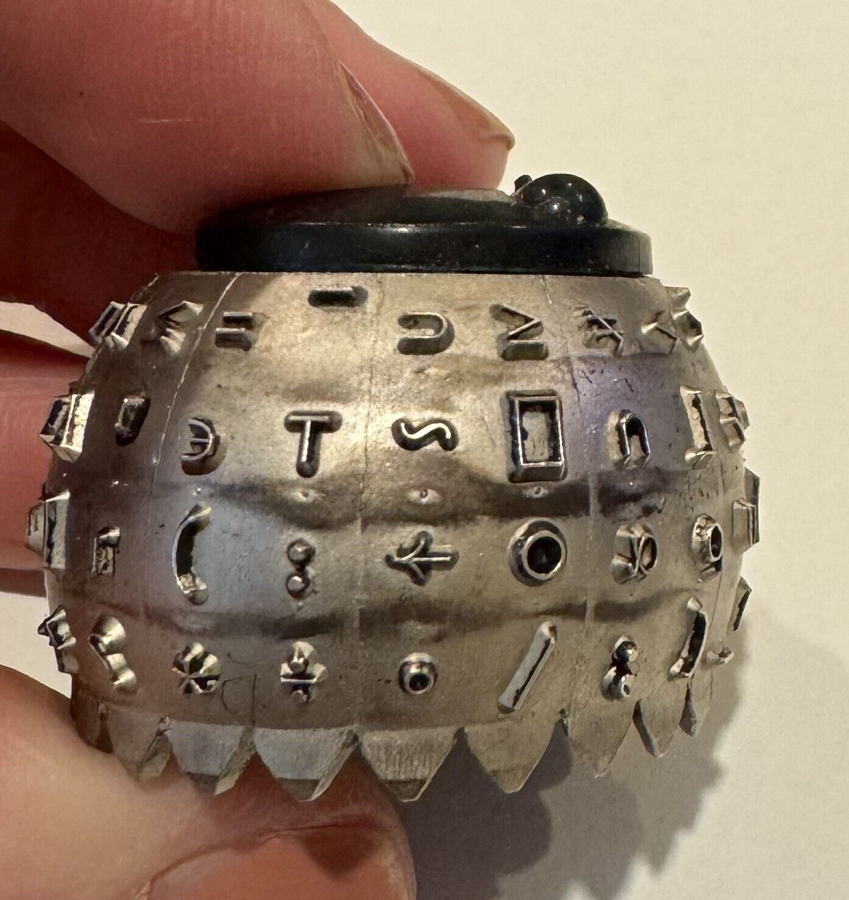

# APL on the VT340

[ Screenshot goes here ]

DEC provided an [APL softchar font](aplfontb9/README.md) for the VT340
that allowed programmers to write in the APL language without having
to use one of those fancy IBM selectric typewriters with a special
"golf ball" typing element to handle all the strange characters.

 

The APL programming language imposes requirements on a terminal
similar to a foreign natural language. APL uses,

* [different nomenclature](nomenclature.md) for describing the characters,
* a [different font](aplfontb9/README.md) for output, and
* a [different keyboard](img/LK201-APL-kbd.png) for input.

See the
[VAX APL User's Guide](../docs/kindred/AA-P142E-TE_VAX_APL_Users_Guide_Jun91_text.pdf) 
for information on how those pieces were defined and worked together. 

_____

Historical footnote: Long before the VT340, DEC sold terminals for APL
programming. In 1980 DEC released DECSTD-107 which defined the [layout
for an APL keyboard](1980/apl1980kbd.png) and released a [specialized
version of the VT102](1980/vt102apl.png). That keyboard layout and
character set was _not_ used ten years later on the VT340.
