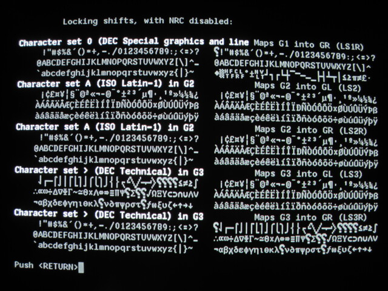

# Character Sets on the VT340

[](allchars.jpg)

While the DEC VT340 had impressive multilingual capabilities for its
time, it predated Unicode by decades and is tricky to use with current
multilingual software. Instead of a single codepage which contains
millions of characters, there were a multitude of character sets, most
limited to a single byte, and a multitude of ways to select those
character sets.

## A quick tour

There are four methods the VT340 can use to go beyond the 7-bit US
ASCII character set:

1. An 8-bit code, such as DEC-MCS or Latin-1. The VT340 uses the DEC
   Multinational Character Set by default. I (hackerb9) suggest
   switching that to the newer ISO 8859-1 (Latin-1) in the VT340
   Set-Up menu.

2. Escape sequences (ISO 2022 "shifts") to temporarily change the
   meaning of characters. This will be discussed in greater detail
   below.

3. Create a completely new character set by down-line loading a "soft
   character set", which includes redefining the glyphs for the
   80-column and 132-column characters. (Only one soft character set
   can be loaded at a time, but the VT340 does allow a different
   soft character set for each session.)

4. Replace just a handful of the characters in US ASCII to make a
   7-bit "National Replacement Character Set", such as "Portuguese" or
   "Norwegian". NRC is disabled on the the North American VT340 by
   default. Hackerb9 suggests ignoring NRCs completely. The VT340's
   Latin-1 code table covers every character the NRC Sets provided,
   plus it doesn't mangle ASCII text, and can show all of the
   different nationalities simultaneously. The NRC option will not be
   discussed further on this page, but you can [read more here](nrc.md).

### GL & GR


DEC uses the terms "GL" and "GR" to refer to currently active
character sets for the "graphic" characters on the "left" and "right"
of an 8-bit character table. The left contains the usual 7-bit ASCII
and the right contains the bytes with the high-bit set.

<ul>

_Note that "graphic" here just means "visible" and is used to
differentiate from "control" characters in the table which are not
redefinable._

</ul>

<details><summary>Click to see GL/GR table</summary>

|      | ← *C* | *0* → | ←⎯   | ⎯⎯   | ⎯*G* | *L*⎯ | ⎯⎯   | ⎯→   | ←⎯*C* | *1*⎯→ | ←⎯   | ⎯⎯   | ⎯*G* | *R*⎯ | ⎯⎯   | ⎯→   |
|------|-------|-------|------|------|------|------|------|------|-------|-------|------|------|------|------|------|------|
|      | *00*  | *01*  | *02* | *03* | *04* | *05* | *06* | *07* | *08*  | *09*  | *10* | *11* | *12* | *13* | *14* | *15* |
| *00* | NUL   | DLE   | SP   | 0    | @    | P    | `    | p    |       | DCS   | NBSP | °    | À    | Ð    | à    | ð    |
| *01* | SOH   | DC1   | !    | 1    | A    | Q    | a    | q    |       | PU1   | ¡    | ±    | Á    | Ñ    | á    | ñ    |
| *02* | STX   | DC2   | "    | 2    | B    | R    | b    | r    |       | PU2   | ¢    | ²    | Â    | Ò    | â    | ò    |
| *03* | ETX   | DC3   | #    | 3    | C    | S    | c    | s    |       | STS   | £    | ³    | Ã    | Ó    | ã    | ó    |
| *04* | EOT   | DC4   | $    | 4    | D    | T    | d    | t    | IND   | CCH   | ¤    | ´    | Ä    | Ô    | ä    | ô    |
| *05* | ENQ   | NAK   | %    | 5    | E    | U    | e    | u    | NEL   | MW    | ¥    | µ    | Å    | Õ    | å    | õ    |
| *06* | ACK   | SYN   | &    | 6    | F    | V    | f    | v    | SSA   | SPA   | ¦    | ¶    | Æ    | Ö    | æ    | ö    |
| *07* | BEL   | ETB   | '    | 7    | G    | W    | g    | w    | ESA   | EPA   | §    | ·    | Ç    | ×    | ç    | ÷    |
| *08* | BS    | CAN   | (    | 8    | H    | X    | h    | x    | HTS   |       | ¨    | ¸    | È    | Ø    | è    | ø    |
| *09* | HT    | EM    | )    | 9    | I    | Y    | i    | y    | HTJ   |       | ©    | ¹    | É    | Ù    | é    | ù    |
| *10* | LF    | SUB   | *    | :    | J    | Z    | j    | z    | VTS   |       | ª    | º    | Ê    | Ú    | ê    | ú    |
| *11* | VT    | ESC   | +    | ;    | K    | [    | k    | {    | PLD   | CSI   | «    | »    | Ë    | Û    | ë    | û    |
| *12* | LF    | FS    | ,    | <    | L    | \\   | l    | \|   | PLU   | ST    | ¬    | ¼    | Ì    | Ü    | ì    | ü    |
| *13* | CR    | GS    | -    | =    | M    | ]    | m    | }    | RI    | OSC   | \­   | ½    | Í    | Ý    | í    | ý    |
| *14* | SO    | RS    | .    | >    | N    | ^    | n    | ~    | SS2   | PM    | ®    | ¾    | Î    | Þ    | î    | þ    |
| *15* | SI    | US    | /    | ?    | O    | _    | o    | DEL  | SS3   | APC   | ¯    | ¿    | Ï    | ß    | ï    | ÿ    |
</details>
																						  		 			   
## Latin-1 and friends

The VT340's setup menu does not allow setting GL and GR directly, but
one can change the displayed character set, which does the same thing.
For example, the author of this page (hackerb9) prefers to use Latin-1
and sets the environment variable `LANG` to en_US.iso88591 to inform
programs to display characters correctly. (Note: for LANG to work,
modern systems often require uncommenting iso88591 in /etc/locale.gen
and then re-running `sudo locale-gen`).

<ul>

``` bash
export LANG=$(locale -a 2>&- | egrep -s 8859.*15?$ | head -1)
[ "$LANG" ] || export LANG=C    # No Latin-1, so fallback to "C"
```

</ul>

## ISO 2022: "Shifting" (multibyte characters)

While an 8-bit code works for single-byte character sets, the VT340
can simultaneously show characters that are beyond that range by using
multiple bytes per character via "shifting". (See: "[ISO 2022:1986](../docs/standards/ECMA-35_1985.pdf").

<ul>
* Quick shifting example (partial differential):

  ```bash
  $ echo $'\e+>'
  $ echo $'\eO\x64'
  ∂
  ```
</ul>

To make things slightly confusing, there is an extra layer of
indirection. In order to shift the character set the VT340 has four
"intermediate sets" G0, G1, G2, and G3 which the user (or a program)
defines to point to specific translation tables. Once an intermediate
set is defined, GL or GR can be set to point to it so it'll actually
be used for the next character(s).

In the example above, the first line (`\e+>`) selected "DEC Technical
Character Set" for G3. The second line (`\eO\x64`) instructed the
VT340 to temporarily shift in G3 and show codepoint 0x64, which
happens to be "∂" in DEC Tech (and "d" in ASCII).

<details>

While setting G0 through G3 could be done one at a time, some
character sets requires setting more than one. For example, a terminal
like the VT382-J or MS Kermit could use Japanese EUC , which is a
mixture of single-byte JIS X 0201 (two character sets) and double-byte
JIS X 0208, like so:

* Japanese Roman in G0,
* Japanese Kanji in G1,
* Japanese Katakana in G2. (Katakana characters are indicated by SS2
  in the data — the SS2 is considered part of the file).

The VT340 doesn't have Kanji and Katakana characters built-in and can
only define one soft font, so it cannot do Japanese EUC.

The G0 set has at most 94 characters and G1–G3 can each hold 96, which
means that, at most, 382 graphics characters can be simultaneously
shown within the repertoire of a typical terminal.

_[XXX: TODO Double check this]_ However, the VT340 seems to have an
interesting feature where changing G0–G3 only alters future
characters; it does not change characters which have already been
printed on the screen. Possibly this is related to the way the VT340
can store arbitrary sixel bitmaps on the screen.

</details>

## Charmap and Locale

It should be possible to create a special locale, based on Latin-1,
but with additional multibyte characters that use single-shifts to
provide better Unicode coverage. If I figure it out, I'll post it
here. See: charmap, gconv, locale-gen, /etc/locale.gen, and the
exploratory ramblings on my [custom charmap](charmap.md) page.


## Character Set Selection

As mentioned above, to make a character set available, it first must
be _selected_ as either G0, G1, G2, or G3. The designated set is then
activated into "GL" or "GR" by sending a single or locking _shift_
before printing a byte. (GL, "Graphic Left", is used for single-byte
characters in which the high bit is cleared, x<=127. GR is analogous,
with the high bit set: 128 <= x <= 255.)

### Select Character Set Sequences (SCS)


The Select Character Set sequence (SCS) assigns a character set to the
G0, G1, G2, or G3 character set designators. This table gives the
sequences that select the available 94-Character Sets. The next table
gives the sequences that select the available 96-Character Sets.


#### Selecting 94-Character Sets

94-character sets range from 0x21 to 0x7E (in GL) or 0xA1 to 0xFE (in GR).

<ul>

| Character Set            | G0              | G1              | G2                | G3              |
|--------------------------|-----------------|-----------------|-------------------|-----------------|
| U.S. ASCII               | ESC(B           | ESC)B           | ESC\*B            | ESC+B           |
| VT100 Graphics           | ESC(0           | ESC)0           | ESC\*0            | ESC+0           |
| DEC Supplemental         | ESC(< or ESC(%5 | ESC)< or ESC)%5 | ESC\*< or ESC\*%5 | ESC+< or ESC+%5 |
| DEC Technical            | ESC(>           | ESC)>           | ESC\*>            | ESC+>           |
| DEC Great Britain        | ESC(A           | ESC)A           | ESC\*A            | ESC+A           |
| German                   | ESC(K           | ESC)K           | ESC\*K            | ESC+K           |
| French (France)          | ESC(R           | ESC)R           | ESC\*R            | ESC+R           |
| Italian                  | ESC(Y           | ESC)Y           | ESC\*Y            | ESC+Y           |
| Spanish                  | ESC(Z           | ESC)Z           | ESC\*Z            | ESC+Z           |
| DEC Dutch                | ESC(4           | ESC)4           | ESC\*4            | ESC+4           |
| DEC Finnish              | ESC(5           | ESC)5           | ESC\*5            | ESC+5           |
| DEC Portuguese           | ESC(%6          | ESC)%6          | ESC\*%6           | ESC+%6          |
| DEC Norwegian/Dutch      | ESC(6           | ESC)6           | ESC\*6            | ESC+6           |
| DEC Swedish              | ESC(7           | ESC)7           | ESC\*7            | ESC+7           |
| DEC French Canadian      | ESC(9           | ESC)9           | ESC\*9            | ESC+9           |
| DEC Swiss                | ESC(=           | ESC)=           | ESC\*=            | ESC+=           |
|                          |                 |                 |                   |                 |
| _Not available on VT340_ | ____            | ____            | ____              | ____            |
| ISO Norwegian/Danish     | ESC(‘           | ESC)’           | ESC\*’            | ESC+’           |
| JIS Roman                | ESC(J           | ESC)J           | ESC\*J            | ESC+J           |
| ISO Katakana             | ESC(I           | ESC)I           | ESC\*I            | ESC+I           |
| 7-Bit Hebrew             | ESC(%=          | ESC)%=          | ESC\*%=           | ESC+%           |
| Hebrew Supplemental      | ESC(“4          | ESC)”4          | ESC\*”4           | ESC+”4          |
| 7-Bit Turkish            | ESC(%2          | ESC)%2          | ESC\*%2           | ESC+%2          |
| Turkish Supplemental     | ESC(%0          | ESC)%0          | ESC\*%0           | ESC+%0          |
| Greek Supplemental       | ESC(“?          | ESC)”?          | ESC\*”?           | ESC+”?          |

</ul>


#### Selecting 96-Character Sets

96-character sets range from 0x20 to 0x7F (in GL) or 0xA0 to 0xFF (in GR).

<ul>

| Character Set            | G0 | G1    | G2    | G3    |
|--------------------------|----|-------|-------|-------|
| ISO Latin 1              |    | ESC-A | ESC.A | ESC/A |
|                          |    |       |       |       |
| _Not available on VT340_ |    | ____  | ____  | ____  |
| ISO Latin 2              |    | ESC-B | ESC.B | ESC/B |
| ISO Latin 5              |    | ESC-M | ESC.M | ESC/M |
| ISO Latin 9              |    | ESC-b | ESC.b | ESC/b |
| ISO Cyrillic             |    | ESC-L | ESC.L | ESC/L |
| ISO Greek                |    | ESC-F | ESC.F | ESC/F |
| ISO Hebrew               |    | ESC-H | ESC.H | ESC/H |

</ul>

_Note: G0 can only hold 94-Character Sets, and thus cannot be used for
these character sets_.

<sub>

If you are curious about the hundreds of other character sets that
were available at the time of the VT340, please see the "[ISO International
Register of Coded Character Sets to be used with Escape
Sequences](https://itscj.ipsj.or.jp/english/)", also known as the "IR".

</sub>

### Activate Character Sets: Single and Locking Shifts

A single shift (SS2 or SS3), effects only the first printable
character following the single shift sequence.

A locking shift (LS2, LS3, LS1R, LS2R, or LS3R) persists until another
locking shift is invoked.

Here are the escape sequences for for Single and Locking Shifts:

<ul>

| Name                  | Mnemonic | Sequence | Hex   | Function                                                          |
|-----------------------|----------|----------|-------|-------------------------------------------------------------------|
| Single Shift 2        | SS2      | ESC N    | 1B 4E | The character that follows SS2 selects from the G2 character set. |
| Single Shift 3        | SS3      | ESC O    | 1B 4F | The character that follows SS3 selects from the G3 character set. |
| Locking Shift 0       | LS0      | \<SI\>   | 0F    | The G0 character set becomes the active GL character set.         |
| Locking Shift 1       | LS1      | \<SO\>   | 0E    | The G1 character set becomes the active GL character set.         |
| Locking Shift 2       | LS2      | ESC n    | 1B 6E | The G2 character set becomes the active GL character set.         |
| Locking Shift 3       | LS3      | ESC o    | 1B 6F | The G3 character set becomes the active GL character set.         |
| Locking Shift 1 Right | LS1R     | ESC ~    | 1B 7E | The G1 character set becomes the active GR character set.         |
| Locking Shift 2 Right | LS2R     | ESC }    | 1B 7D | The G2 character set becomes the active GR character set.         |
| Locking Shift 3 Right | LS3R     | ESC\|    | 1B 7C | The G3 character set becomes the active GR character set.         |

</ul>
