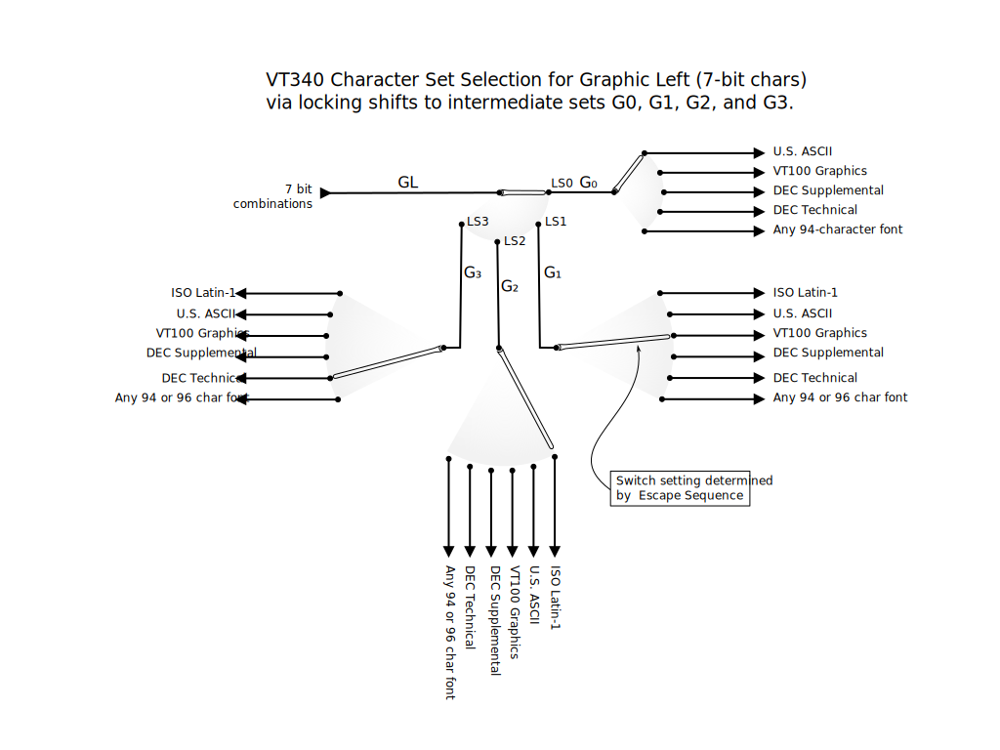
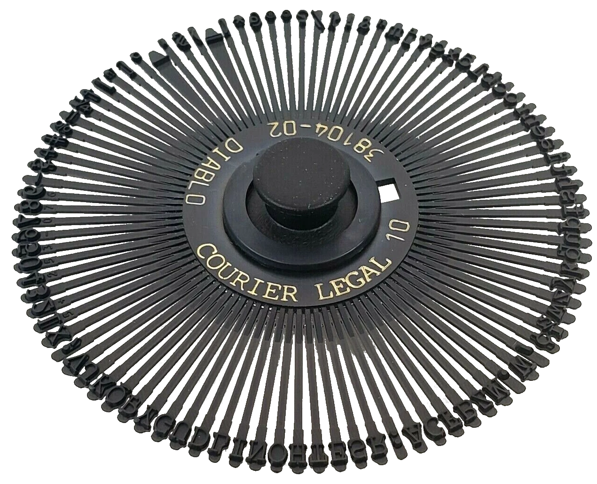

# Character Sets on the VT340

[](allchars.jpg)

While the DEC VT340 had impressive multilingual capabilities for its
time, it predated Unicode by decades and is tricky to use with current
multilingual software. Instead of a single codepage which contains
millions of characters, there were a multitude of character sets, most
limited to a single byte, and a multitude of ways to select those
character sets.

## A quick tour

There are four methods the VT340 can use to go beyond the 7-bit US
ASCII character set:

1. An 8-bit code in "GR". The VT340 uses DEC-MCS by default, but
   Hackerb9 suggests changing that to Latin-1 in the VT340 Set-Up.
   (See below).

2. Escape sequences (ISO 2022 "shifts") to temporarily change the
   meaning of characters. This will be discussed in greater detail
   below.

3. Create a completely new character set by down-line loading a "[soft
   character set](softchars.md)", which includes redefining the glyphs
   for the 80-column and 132-column characters. Only one soft
   character set can be loaded at a time, but the VT340 does allow a
   different soft character set for each session.

4. Replace just a handful of the characters in US ASCII to make a
   7-bit "National Replacement Character Set", such as "Portuguese" or
   "Norwegian". NRC is disabled on the the North American VT340 by
   default. Hackerb9 suggests ignoring NRCs completely. The VT340's
   Latin-1 code table covers every character the NRC Sets provided,
   plus it doesn't mangle ASCII text, and can show all of the
   different nationalities simultaneously. The NRC option will not be
   discussed further on this page, but you can [read more here](nrc.md).

### GL & GR

DEC uses the terms "GL" and "GR" to refer to currently _active_
character sets for the "graphic" characters on the "left" and "right"
of an 8-bit character table. The left contains the usual 7-bit ASCII
and the right contains the bytes with the high-bit set.

<ul>

_Note that "graphic" here just means "visible" and is used to
differentiate from "control" characters in the table which are not
redefinable._

</ul>

<details><summary>Click to see GL/GR table</summary>

In this example, Graphic Left has been filled in with ASCII, as is
typical, while Graphic Right has taken on the Latin-1 character set
(see below).


|      | ← *C* | *0* → | ←⎯   | ⎯⎯   | ⎯*G* | *L*⎯ | ⎯⎯   | ⎯→   | ←⎯*C* | *1*⎯→ | ←⎯   | ⎯⎯   | ⎯*G* | *R*⎯ | ⎯⎯   | ⎯→   |
|------|-------|-------|------|------|------|------|------|------|-------|-------|------|------|------|------|------|------|
|      | *00*  | *01*  | *02* | *03* | *04* | *05* | *06* | *07* | *08*  | *09*  | *10* | *11* | *12* | *13* | *14* | *15* |
| *00* | NUL   | DLE   | SP   | 0    | @    | P    | `    | p    |       | DCS   | NBSP | °    | À    | Ð    | à    | ð    |
| *01* | SOH   | DC1   | !    | 1    | A    | Q    | a    | q    |       | PU1   | ¡    | ±    | Á    | Ñ    | á    | ñ    |
| *02* | STX   | DC2   | "    | 2    | B    | R    | b    | r    |       | PU2   | ¢    | ²    | Â    | Ò    | â    | ò    |
| *03* | ETX   | DC3   | #    | 3    | C    | S    | c    | s    |       | STS   | £    | ³    | Ã    | Ó    | ã    | ó    |
| *04* | EOT   | DC4   | $    | 4    | D    | T    | d    | t    | IND   | CCH   | ¤    | ´    | Ä    | Ô    | ä    | ô    |
| *05* | ENQ   | NAK   | %    | 5    | E    | U    | e    | u    | NEL   | MW    | ¥    | µ    | Å    | Õ    | å    | õ    |
| *06* | ACK   | SYN   | &    | 6    | F    | V    | f    | v    | SSA   | SPA   | ¦    | ¶    | Æ    | Ö    | æ    | ö    |
| *07* | BEL   | ETB   | '    | 7    | G    | W    | g    | w    | ESA   | EPA   | §    | ·    | Ç    | ×    | ç    | ÷    |
| *08* | BS    | CAN   | (    | 8    | H    | X    | h    | x    | HTS   |       | ¨    | ¸    | È    | Ø    | è    | ø    |
| *09* | HT    | EM    | )    | 9    | I    | Y    | i    | y    | HTJ   |       | ©    | ¹    | É    | Ù    | é    | ù    |
| *10* | LF    | SUB   | *    | :    | J    | Z    | j    | z    | VTS   |       | ª    | º    | Ê    | Ú    | ê    | ú    |
| *11* | VT    | ESC   | +    | ;    | K    | [    | k    | {    | PLD   | CSI   | «    | »    | Ë    | Û    | ë    | û    |
| *12* | LF    | FS    | ,    | <    | L    | \\   | l    | \|   | PLU   | ST    | ¬    | ¼    | Ì    | Ü    | ì    | ü    |
| *13* | CR    | GS    | -    | =    | M    | ]    | m    | }    | RI    | OSC   | \­   | ½    | Í    | Ý    | í    | ý    |
| *14* | SO    | RS    | .    | >    | N    | ^    | n    | ~    | SS2   | PM    | ®    | ¾    | Î    | Þ    | î    | þ    |
| *15* | SI    | US    | /    | ?    | O    | _    | o    | DEL  | SS3   | APC   | ¯    | ¿    | Ï    | ß    | ï    | ÿ    |
</details>

### GLGR.sh

The [GLGR.sh](GLGR.sh) program will display the VT340's (or any
terminal's) current Graphic Left and Graphic Right character sets.

## 1. Latin-1 and friends

The author of this page (hackerb9) prefers to use Latin-1. There are
two steps to set that up:

1. In the VT340 SET-UP menu, go to General Set-Up and change User
   Preference Char Set from DEC-MCS to Latin-1. 
   
2. Inform programs on the host machine to use that encoding by setting
   the environment variable `LANG` to en_US.iso88591.

<ul>

``` bash
export LANG=$(locale -a 2>&- | egrep -s 8859.*15?$ | head -1)
[ "$LANG" ] || export LANG=C    # No Latin-1, so fallback to "C"
```

_Note: for LANG to work, modern systems often require uncommenting
iso88591 in /etc/locale.gen and then re-running `sudo locale-gen`._

<sub>See hackerb9's [vt340 setup script](../usage/vt340.setup.sh) that sets
`LANG` and some other useful configurations for anyone attempting to
use a VT340 in modern times.</sub>

</ul>

## 2. ISO 2022: "Shifting" (multibyte characters)

While an 8-bit code works for single-byte character sets, the VT340
can simultaneously show characters that are beyond that range by using
multiple bytes per character via "shifting". 
(See: "[ISO 2022:1986](../docs/standards/ECMA-35_1985.pdf)").



### Quick shifting example (delta):

<ul>

  ```bash
  $ echo $'\e+>'
  $ echo $'\eO\x64'
  δ
  ```

</ul>

### G0, G1, G2, G3

To make things slightly confusing, there is an extra layer of
indirection. Before a character set can be activated (see shifting
below), first it must be loaded into an "intermediate set". the VT340
has four "G-sets", G0, G1, G2, and G3, which can be set to point to
specific translation tables. Once an intermediate set is defined, GL
or GR can be "shifted" to point to it so it'll actually be used for
the next character(s).

| Escape sequence | Meaning                   |
|-----------------|---------------------------|
| `\e+>`          | Set G3 to TCS             |
| `\eO`           | Single shift to G3        |
| `\x64`          | Show codepoint 0x64 in G3 |

In the example above, the first line (`\e+>`) selected "DEC Technical
Character Set" (TCS) for G3. The second line (`\eO\x64`) instructed
the VT340 to temporarily shift in G3 and show codepoint 0x64, which
happens to be "∂" in DEC Tech (and "d" in ASCII).


<UL>
   
   The VT340 manual states that, when you turn on or reset the
   terminal, you automatically select either the DEC multinational
   character set or ISO Latin-1, depending upon what the user
   preferred supplemental set is.

   It should be noted that the logical assumption that the 8-bit set
   will be in G1, just as the 7-bit set is in G0, is **incorrect**. In
   fact, this is how a VT340's presets look at power-on:
   
   |         Name | Points to      |   |          Name | Points to      |
   |-------------:|----------------|---|--------------:|----------------|
   | Graphic Left | G0             |   | Graphic Right | G2             |
   |              |                |   |               |                |
   |           G0 | ASCII          |   |            G1 | ASCII          |
   |           G2 | MCS or Latin-1 |   |            G3 | MCS or Latin-1 |

   The rationale behind this is not yet clear. 

</ul>

_Tip_: Hackerb9's [GLGR.sh](GLGR.sh) program is an easy way to see the
characters currently loaded in G0, G1, G2, and G3.



### Physical Analogy: Four daisywheels 

Back in the olden days, typewriters had interchangeable "daisywheels",
each of which could hold a different typeface (character set).

The VT340 is like a mythical typewriter with slots for four
daisywheels, labeled **G0** through **G3**. It can use any two slots
at the same time, which can be thought of as two slider controls,
**GL** and **GR**, with arrows that can point to any of the four
slots.

<br clear=all>

### Example: APL

The [VAX/VMS APL User's Guide][APLUG] shows that all four intermediate sets
were mapped to create a "composite" character set:

| Set | Mapping          | Escape sequence                |
|-----|------------------|--------------------------------|
| G0  | ASCII            | `ESC` `(` `B`                  |
| G1  | APL              | `ESC` `)` `&` `0`              |
| G2  | Latin-1 or MCS   | `ESC` `.` `A` or `ESC` `(` `<` |
| G3  | Special Graphics | `ESC` `+` `0`                  |
| GL  | G0               | `0x0F`                         |
| GR  | G1               | `ESC` `~`                      |

(See [APL Composite font](DECAPL.md).)

[APLUG]: ../vms/apl/PDF_DOCS/AA-P142E-TE_VAX_APL_Users_Guide_Jun91_text.pdf "APL Users' Guide (1991)"


### How many characters can the VT340 show using ISO-2022?

While setting G0 through G3 could be done one at a time, some
character sets requires setting more than one. For example, a terminal
like the VT382-J or MS Kermit could use Japanese EUC , which is a
mixture of single-byte JIS X 0201 (two character sets) and double-byte
[JIS X 0208](../docs/standards/IR168-Japanese.pdf), like so:

* Japanese Roman in G0,
* Japanese Kanji in G1,
* Japanese Katakana in G2. (Katakana characters are indicated by SS2,
  `ESC N`, in the data).

The VT340 does not have Kanji and Katakana characters built-in and can
only define one soft font, so it cannot do Japanese EUC. Moreover, its
soft font is limited to a single byte, so it cannot show Japanese
Kanji without help from the host software to dynamically redefine the
character set.

<details>

In ISO-2022, the G0 set has at most 94 characters and G1–G3 can each
hold 96, which means that, at most, 382 graphics characters can be
simultaneously held within the repertoire of a typical terminal.

However, the VT340 is _not_ limited to 382. Character sets can be
changed at will on the VT340 without worry about previously displayed
characters being altered. For example:

``` bash
$ echo -n $'\e+0\eOg\e+>\e0g\r'; tput smir; echo "both in g3: "; tput rmir
both in g3: ±γ
```

[Insert mode (smir) used to show that the glyphs are still characters,
not just bitmap detritus].

Even more importantly, User Defined "soft" character sets (via
[Down-Line-Loading](softchars.md)) can be altered without affecting
the appearance of characters already shown. The VT340 Text Programming
manual states:

<blockquote><i>
<b>PROGRAMMING TIP:</b>

When you use the DECDLD device control string to load a soft character
set, the control string does not affect the characters currently on
the screen. You can refresh the screen to show the new character sets.
See Chapter 2 for general information about device control strings.
</i></blockquote>

[Todo: The following has not yet been proven.] Theoretically, a VT340
could show a different character in every character cell. That means a
total of **2000** (=80×25) characters could be shown on-screen
simultaneously.

<details><summary>Click to see ~~fudging~~ fanciful numbers.</summary>

If one allows for a thinner, less legible, 132 column font, then
**3300** (=132×25) characters can be shown at once. Or, consider what
can be written to the VT340's screen _memory_: although only 24 lines
can be shown at a time, 144 lines can be written on and scrolled
through using Page Memory commands (<kbd>Shift</kbd> +
<kbd>Prev<br/>Screen</kbd> / <kbd>Next<br/>Screen</kbd>). That gives
**19,140** characters! (145×132, one status line for all pages).
Trying to actually do this would be an extremely silly, but
interesting, challenge.

</details>

However, this has not been verified as there are very few [VT340
fonts](softchars.md) available. [What has been tested: Hackerb9 has
confirmed that the status line responds to the Select Character Set
command and appears to keep a separate notion of GL and GR from the
main screen. Hackerb9 also confirmed that using page memory does not
reset already drawn characters. Still to do: find or generate enough
fonts that this can actually be tested].

</details>


## Charmap and Locale

It should be possible to create a special locale, based on Latin-1,
but with additional multibyte characters that use single-shifts to
provide better Unicode coverage. If I figure it out, I'll post it
here. See: charmap, gconv, locale-gen, /etc/locale.gen, and the
exploratory ramblings on my [custom charmap](charmap.md) page.


## Character Set Selection

As mentioned above, to make a character set available, it first must
be _selected_ as either G0, G1, G2, or G3. The designated set is then
activated into "GL" or "GR" by sending a single or locking _shift_
before printing a byte. (GL, "Graphic Left", is used for single-byte
characters in which the high bit is cleared, x<=127. GR is analogous,
with the high bit set: 128 <= x <= 255.)

### Select Character Set Sequences (SCS)

The Select Character Set sequence (SCS) assigns a character set to G0,
G1, G2, or G3.

* `ESC` _`I`_ _`Dscs`_ <br>
   Example: `Esc ( B` loads the ASCII character set into G0. 

_I_ is an Intermediate character from the table below and _Dscs_ is a
one or two character sequence designating a specific character set.
(See tables even further below).

<ul>

  | G-set | 94-character<br>Intermediate | 96-character<br>Intermediate |
  |-------|:----------------------------:|:----------------------------:|
  | G0    | (                            | None                         |
  | G1    | )                            | -                            |
  | G2    | \*                           | .                            |
  | G3    | +                            | /                            |

</ul>

<sub>
_Note: 94- and 96-character sets are different even if they have the same Dscs code.
For example, `Esc ) A` loads the UK charset, while `Esc - A` loads Latin-1._
</sub>

#### Selecting 94-Character Sets

94-character sets range from 0x21 to 0x7E (in GL) or 0xA1 to 0xFE (in
GR). It is exactly the ASCII range of 
"[graphic](http://www.bitsavers.org/pdf/att/unix/System_III/UNIX_Users_Manual_Release_3_Jun80.pdf#page=496)" 
(visible) characters from `!` to `~`.

This table gives the sequences that select all the available
94-Character Sets on the VT340 — for 96, see next section — plus some
of the ones that require a soft font to use.

<ul>

| Character Set          | G0              | G1              | G2                | G3              |
|------------------------|-----------------|-----------------|-------------------|-----------------|
| U.S. ASCII             | ESC(B           | ESC)B           | ESC\*B            | ESC+B           |
| VT100 Graphics         | ESC(0           | ESC)0           | ESC\*0            | ESC+0           |
| DEC Supplemental       | ESC(< or ESC(%5 | ESC)< or ESC)%5 | ESC\*< or ESC\*%5 | ESC+< or ESC+%5 |
| DEC Technical          | ESC(>           | ESC)>           | ESC\*>            | ESC+>           |


<details><summary>Not builtin to the VT340</summary>

| Character Set          | G0              | G1              | G2                | G3              |
|------------------------|-----------------|-----------------|-------------------|-----------------|
| ISO Norwegian/Danish   | ESC(\‘          | ESC)\`          | ESC\*\`           | ESC+\`          |
| JIS Roman              | ESC(J           | ESC)J           | ESC\*J            | ESC+J           |
| ISO Katakana           | ESC(I           | ESC)I           | ESC\*I            | ESC+I           |
| 7-Bit Hebrew           | ESC(%=          | ESC)%=          | ESC\*%=           | ESC+%           |
| Hebrew Supplemental    | ESC(“4          | ESC)”4          | ESC\*”4           | ESC+”4          |
| 7-Bit Turkish          | ESC(%2          | ESC)%2          | ESC\*%2           | ESC+%2          |
| Turkish Supplemental   | ESC(%0          | ESC)%0          | ESC\*%0           | ESC+%0          |
| Greek Supplemental     | ESC(“?          | ESC)”?          | ESC\*”?           | ESC+”?          |
| APL Key Paired         | ESC(8           | ESC)8           | ESC\*8            | ESC+8           |
| APL Composite          | ESC(&0          | ESC)&0          | ESC\*&0           | ESC+&0          |

</details>
</ul>


#### Selecting 96-Character Sets

96-character sets range from 0x20 to 0x7F (in GL) or 0xA0 to 0xFF (in
GR). They are the same as 94, but with the addition of being able to
have glyphs in 0x20 ("space") and 0x7F ("delete").

The VT340 comes with only one 96-character set built-in, Latin-1.
Beneath are listed are some example 96-character soft fonts.

<ul>

| Character Set              | G0 | G1    | G2    | G3    |
|----------------------------|----|-------|-------|-------|
| ISO Latin 1                | -  | ESC-A | ESC.A | ESC/A |

<details><summary>Not builtin to the VT340</summary>

| Character Set          | G0 | G1    | G2    | G3    |
|------------------------|----|-------|-------|-------|
| ISO Latin 2            | -  | ESC-B | ESC.B | ESC/B |
| ISO Latin 5            | -  | ESC-M | ESC.M | ESC/M |
| ISO Latin 9            | -  | ESC-b | ESC.b | ESC/b |
| ISO Cyrillic           | -  | ESC-L | ESC.L | ESC/L |
| ISO Greek              | -  | ESC-F | ESC.F | ESC/F |
| ISO Hebrew             | -  | ESC-H | ESC.H | ESC/H |

</details>
</ul>

_Note: G0 can only hold 94-Character Sets, and thus cannot be used for
these character sets_.

<sub><blockquote>

If you are curious about the hundreds of other character sets that
were available at the time of the VT340, please see the "[ISO International
Register of Coded Character Sets to be used with Escape
Sequences](https://itscj.ipsj.or.jp/english/)", also known as the "IR".

</blockquote></sub>

### Activate Character Sets: Single and Locking Shifts

A single shift (SS2 or SS3), affects only the first printable
character following the single shift sequence.

A locking shift (LS2, LS3, LS1R, LS2R, or LS3R) persists until another
locking shift is invoked.

Here are the escape sequences for Single and Locking Shifts:

<ul>

| Name                  | Mnemonic | Sequence | Hex   | Function                                                          |
|-----------------------|----------|----------|-------|-------------------------------------------------------------------|
| Single Shift 2        | SS2      | ESC N    | 1B 4E | The character that follows SS2 selects from the G2 character set. |
| Single Shift 3        | SS3      | ESC O    | 1B 4F | The character that follows SS3 selects from the G3 character set. |
|                       |          |          |       |                                                                   |
| Locking Shift 0       | LS0      | \<SI\>   | 0F    | The G0 character set becomes the active GL character set.         |
| Locking Shift 1       | LS1      | \<SO\>   | 0E    | The G1 character set becomes the active GL character set.         |
| Locking Shift 2       | LS2      | ESC n    | 1B 6E | The G2 character set becomes the active GL character set.         |
| Locking Shift 3       | LS3      | ESC o    | 1B 6F | The G3 character set becomes the active GL character set.         |
|                       |          |          |       |                                                                   |
| Locking Shift 1 Right | LS1R     | ESC ~    | 1B 7E | The G1 character set becomes the active GR character set.         |
| Locking Shift 2 Right | LS2R     | ESC }    | 1B 7D | The G2 character set becomes the active GR character set.         |
| Locking Shift 3 Right | LS3R     | ESC\|    | 1B 7C | The G3 character set becomes the active GR character set.         |

</ul></sub><i>

Note: There is no SS0 (single-shift to G0) since it would be a no-op;
G0 is already the default for 7-bit characters. But, why is there no
SS1 (single-shift to G1)? The answer is unclear, but one guess would
be that it was presumed that usually GR would be set to G1 and
therefore one could just send a byte with the eighth-bit high
(characters 128 to 255) to display any character from G1.
Unfortunately, since UNIX systems now universally use UTF-8 for
Unicode, there is a small but real need for SS1.

</i></sub></ul>

