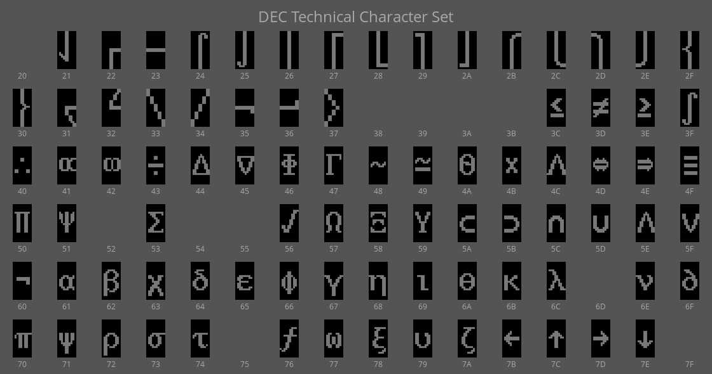

# uplineloadfont.c

uplineloadfont saves the glyphs a terminal can display as image files. It is meant to be the opposite of downline-loading a soft font onto a terminal. 

### Method

This program shows each glyph from the Technical Character Set on the
screen of the terminal and then saves a bitmap of it using the MediaCopy to Host
escape sequence. It should work on any terminal that understands that escape sequence. 
(`Esc [ 2 i`).

**BUG**: The program is currently hardcoded to TCS, but can create output for any character set by changing the Select Character Set escape sequence in main.c. 

### Compilation 

This should compile easily with any reasonably modern C compiler.
(Just type `make run`). 

### Output Format

Ideally, this would be able to output the font as a downline-loadable font file. It does not do that, yet. Instead it creates separate files in the sixel image format. The files can be easily converted to other formats using ImageMagick. 

The filenames that will be created will be based upon which character set was selected and the character cell size (e.g., 10x20 for an 80-column font and 6x20 for 132-column).

### Example output

Also see the individual sixel image files in this directory's subdirectories.
