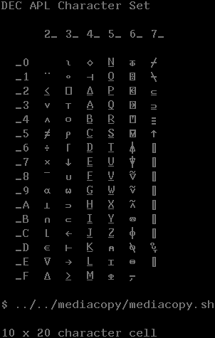

# uplineloadfont.c


uplineloadfont saves the glyphs a terminal can display as image files. It is meant to be the opposite of downline-loading a soft font onto a terminal. 

### Method



This program shows each glyph from the Technical Character Set on the
screen of the terminal and then saves a bitmap of it using the MediaCopy to Host
escape sequence. It should work on any terminal that understands that escape sequence. 
(`Esc [ ? 2 i`).

**BUG**: The program is currently hardcoded to TCS, but can create output for any character set by changing the Select Character Set (`scs`) escape sequence at the start of uplineloadfont.c. 

**BUG**: Character cell size is automatically detected when the program first starts by examining the height and width of certain characters from the VT100 Graphics Character Set. This program would fail on a terminal which does not support that typeface.

### Compilation 

This should compile easily with any reasonably modern C compiler.
Just type
```
make run` 
```

### Output Format

Ideally, this would be able to output the font as a downline-loadable
font file. It does not do that, yet. Instead it creates separate files
in the sixel image format, char-tcs-10x20-21.six to -7E.six. The files
can be easily converted to other formats using ImageMagick.

The filenames that will be created will be based upon which character set was selected and the character cell size (e.g., 10x20 for an 80-column font and 6x20 for 132-column).

### Example output

This is a montage of the output files:


Also see the individual sixel image files in the subdirs of this directory.

Here is an example of changing `char *scs="\e+&0";` in
uplineloadfont.c, which is the code for assigning the DEC APL soft
character set to G3. Of course, one has to load the soft font into the
terminal first for that to work: do so using `cat ../softfonts/aplfont/*340*`.


