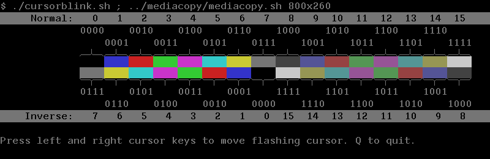

# VT340 Default Color Map

| Index |   H |  L |  S |   |  R |  G |  B | Text attribute    | DEC name |
|-------|----:|---:|---:|---|---:|---:|---:|-------------------|----------|
| 0     |   0 |  0 |  0 |   |  0 |  0 |  0 | Screen Background | Black    |
| 1     |   0 | 49 | 59 |   | 20 | 20 | 79 |                   | Blue     |
| 2     | 120 | 46 | 71 |   | 79 | 13 | 13 |                   | Red      |
| 3     | 240 | 49 | 59 |   | 20 | 79 | 20 |                   | Green    |
| 4     |  60 | 49 | 59 |   | 79 | 20 | 79 |                   | Magenta  |
| 5     | 300 | 49 | 59 |   | 20 | 79 | 79 |                   | Cyan     |
| 6     | 180 | 49 | 59 |   | 79 | 79 | 20 |                   | Yellow   |
| 7     |   0 | 46 |  0 |   | 46 | 46 | 46 | Foreground Text   | Gray 50% |
| 8     |   0 | 26 |  0 |   | 26 | 26 | 26 | Bold+Blink FG     | Gray 25% |
| 9     |   0 | 46 | 28 |   | 33 | 33 | 59 |                   | Blue*    |
| 10    | 120 | 42 | 38 |   | 59 | 26 | 26 |                   | Red*     |
| 11    | 240 | 46 | 28 |   | 33 | 59 | 33 |                   | Green*   |
| 12    |  60 | 46 | 28 |   | 59 | 33 | 59 |                   | Magenta* |
| 13    | 300 | 46 | 28 |   | 33 | 59 | 59 |                   | Cyan*    |
| 14    | 180 | 46 | 28 |   | 59 | 59 | 33 |                   | Yellow*  |
| 15    |   0 | 79 |  0 |   | 79 | 79 | 79 | Bold Foreground   | Gray 75% |

<ul><i><sup>
* These colors are less saturated than colors 1 through 6.
</sup></i></ul>


Unlike modern systems, on the VT340, R, G, B range from 0 to 100
percent in decimal. Another difference is that a Hue angle of 0
degrees is blue on the VT340, not red.

## Documentation differs

Note that the above table contains the _actual_ values retrieved from a
VT340+ after doing a factory reset of the settings. Almost all values
have slightly lower lightness or saturation than what is printed in
the manual. Most significantly, the foreground color (7) in the manual
is listed as 53% (#878787) in the manual, but in reality it is 46%
(#757575). Perhaps in an earlier firmware revision it did match the
manual. At some point, it seems it was decided, for every color except
the foreground, to subtract 1 from the percent saturation and subtract
0 or 1 from the lightness.

Here is the HLS side of table 2-3 VT340 Default Color Map from the
VT340 Graphics Programming manual (2nd ed.), with the delta of how it
changed in the actual hardware.

```
Index	 H   	  L	    S
0      	 0   	  0         0
1      	 0   	 50 -1     60 -1
2      	120  	 46        70 -1
3      	240  	 50 -1     60 -1
4      	 60  	 50 -1     60 -1
5      	300  	 50 -1     60 -1
6      	180  	 50 -1     60 -1
7      	 0   	 53 -6      0
8      	 0   	 26         0
9      	 0   	 46        29 -1
10     	120  	 43 -1     39 -1
11     	240  	 46        29 -1
12     	 60  	 46        29 -1
13     	300  	 46        29 -1
14     	180  	 46        29 -1
15     	 0   	 80 -1      0
```

## Connection between text attributes and colormap

Although the VT340 supports text colors, it is not "ANSI color".
Instead, it represents some text attributes by using four specific
colors in the colormap: 0, 7, 8, and 15.

| Style      | Color Index | Used as color for  | VT340 Default |
|------------|-------------|--------------------|---------------|
| Background | 0           | Background screen  | Black         |
| Foreground | 7           | Normal text        | Medium gray   |
| Bright     | 15          | Bold text          | Light gray    |
| Blink      | 8           | Bold+Blinking text | Dark gray     |

For example, sending the ANSI escape sequence for **bold** text,
`␛[1m`, uses color number 15 as the foreground instead of 7.
Conversely, to change the bold text color on a VT340, set color
index 15 using ReGIS: `␛P0pS(M15(AH60L80s60))␛\`

Note that this color map is shared with sixel and ReGIS graphics,
which means displaying images can mess up text legibility. Although
DEC has mitigated that somewhat by making sixel's access to the
colormap indirect and by starting at index 1: The first six bitmap
colors used do not affect the text. The seventh color in the image
changes the foreground (index 7) and only an image which needs all 16
colors will wrap all the way back to index 0 and modify the
background.

The VT340's Bold+Blink rendering is peculiar (15/0 alternating with 8/7). 
(See [Character attributes in combination](#Character-attributes-in-combination) below.)

### Resetting the colormap

Since displaying sixel images with 7 or more colors can make text
unreadable, it would be good if one could reset the colormap without
being able to see what is on the screen. The simplest way is to use
the builtin Color Set-up by pressing these keys on a VT340 keyboard:

<ul>
<kbd>Set-Up</kbd>
<kbd>Prev Screen</kbd>
<kbd>Do</kbd>
<kbd>Set-Up</kbd>
</ul>

Also see: [colorreset.md](colorreset.md).


## Character attributes in combination

For the most part, the use of colors behave as one would expect when
attributes are used in combination. The one perhaps surprising design
choice is how the VT340 renders Bold+Blinking text.

For normal text, The Blink attribute is displayed as normal text (7 on
0) alternating with reversed normal text (0 on 7) once a second.
However, for Bold text, Blink does **not** look the same as Bold text
(15 on 0) alternating with Reverse Bold text (0 on 15). Instead, it
shows Bold text (15 on 0) alternating with Blink+Bold text (8 on 7).
This is the only time that hackerb9 has found the VT340 using color
number 8 for text attributes.

|               Attributes | Foreground | Background | Escape Sequence |
|-------------------------:|------------|------------|-----------------|
|                   Normal | 7          | 0          | `␛[0m`          |
|                     Bold | 15         | 0          | `␛[1m`          |
|                  Reverse | 0          | 7          | `␛[7m`          |
|             Reverse Bold | 0          | 15         | `␛[1;7m`        |
|              Blink (off) | 7          | 0          | `␛[5m`          |
|                   " (on) | 0          | 7          | "               |
|         Bold Blink (off) | 15         | 0          | `␛[1;5m`        |
|                   " (on) | 8          | 7          | "               |
| Reverse Bold Blink (off) | 0          | 15         | `␛[1;5;7m`      |
|                   " (on) | 7          | 8          | "               |

Note that the _Underline_ character attribute (`␛[5m`) is not
mentioned in this table because the VT340 renders it as an actual
underline, not through color.

## Inverse colors



The VT340 has a concept of "inverse" colors in at least one sense:
when the cursor is on top of sixel data, it flashes between normal and
some other color picked from the palette. To find the inverse index
number, xor the normal index number with 7. That flips the low three
bits but keeps the high bit of the nybble.

```
INVERSE COLOR PAIRS: XOR 7
	0--7		 8--15
	1--6		 9--14
	2--5		10--13
	3--4		11--12
```

Note that this mapping works somewhat like the way that text
attributes are already inverted during Blink and Reverse (as above).
Both Blink and Reverse swap foreground text color 7 with background
color 0. When blinking, **bold** text color 15 is switched with its
inverse, color 8. However, this analogy is not perfect: reversed, bold
text color 15 is swapped with background color 0, not 8 as would be
expected.

Todo: Does the ReGIS graphics cursor invert the colors in the same way?
What about ReGIS logical NOT operator?

### Inverse when using the default VT340 colormap

One benefit of keeping the high bit is that inverting a color will not
change the saturation when using the default colormap. Colors 8 to 15
are lower saturation versions of colors 0 to 7.

The default colormap also makes the relationship between a color and
its inverse simple to describe in terms of Hue, Saturation, and
Lightness:

* If Saturation is 0 (gray), then the Lightness Percent is offset by
  around 50 percentile points.

* If Saturation is >0 (color), then the Hue Angle is rotated by 180
  degrees.


## Interactively choosing screen colors for text

### Built-in color chooser

The VT340 includes in its firmware a Color Set-up screen which allows
one to recall the saved color map, save the color map, or adjust the
RGB values of any of the 16 colors in the palette. Set color #0 for
background and #7 for text foreground.

### rgb.sh script for text colors

An easier way to pick text colors is to use the
[rgb.sh](../vms/rgb.sh) script to interactively choose colors from a
list for Background, Foreground, Bold, and Blink. Once favorite colors
are known, it can be used non-interactively via arguments: `rgb.sh 12
14 55 41`.

<a href="../vms/rgb.sh">

</a>

The script was originally written for the VT241 and is a bit clunky.
Unlike the VT340's built-in Color Set-up, rgb.sh does not show a
preview of the color choices, only names such as "Cornflower Blue",
"Goldenrod", or "Turquoise". Additionally, only certain color names
(RGBCMYKW) are recognized, all others must be chosen by number.

<!-- Perhaps someday someone, maybe me, will rewrite this using proper
ReGIS graphics to display previews of the colors. -->

#### VT340 Emulation Question

Which, if any, VT340 emulators can run rgb.sh? Emulators typically do
not use the colormap to represent text attributes. Additionally, they
would need to support ReGIS graphics for setting individual colors in
the palette.
