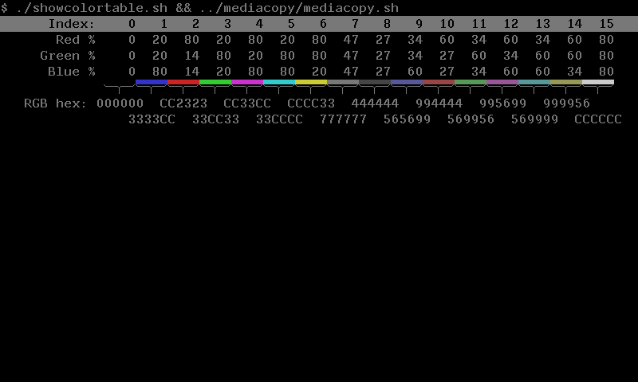

# VT340 Default Color Map

```
Index	 H    L   S		 R   G   B
0      	 0    0   0		 0   0   0	Background
1      	 0   49  59		20  20  79 
2      	120  46  71		79  13  13 
3      	240  49  59		20  79  20			
4      	 60  49  59		79  20  79			
5      	300  49  59		20  79  79
6      	180  49  59		79  79  20
7      	 0   46   0		46  46  46	Foreground
8      	 0   26   0		26  26  26
9      	 0   46  28		33  33  59
10     	120  42  38		59  26  26
11     	240  46  28		33  59  33
12     	 60  46  28		59  33  59
13     	300  46  28		33  59  59
14     	180  46  28		59  59  33
15     	 0   79   0		79  79  79	Bright FG
```



Unlike modern systems, on the VT340, R, G, B range from 0 to 100
percent in decimal. Another difference is that a Hue angle of 0
degrees is blue on the VT340, not red.

## Documentation differs

Note that the above table contains the _actual_ values retrieved from a
VT340+ after doing a factory reset of the settings. Almost all values
have slightly lower lightness or saturation than what is printed in
the manual. Most significantly, the foreground color (7) in the manual
is listed as 53% (#878787) in the manual, but in reality it is 46%
(#757575). Perhaps in an earlier firmware revision it did match the
manual. At some point, it seems it was decided, for every color except
the foreground, to subtract 1 from the percent saturation and subtract
0 or 1 from the lightness. 

Here is the HLS side of table 2-3 VT340 Default Color Map from the
VT340 Graphics Programming manual (2nd ed.), with the delta of how it
changed in the actual hardware.

```
Index	 H   	  L	    S
0      	 0   	  0         0
1      	 0   	 50 -1     60 -1
2      	120  	 46        70 -1
3      	240  	 50 -1     60 -1
4      	 60  	 50 -1     60 -1
5      	300  	 50 -1     60 -1
6      	180  	 50 -1     60 -1
7      	 0   	 53 -6      0
8      	 0   	 26         0
9      	 0   	 46        29 -1
10     	120  	 43 -1     39 -1
11     	240  	 46        29 -1
12     	 60  	 46        29 -1
13     	300  	 46        29 -1
14     	180  	 46        29 -1
15     	 0   	 80 -1      0
```

## Inverse colors


The VT340 has a concept of "inverse" colors in at least one sense:
when the cursor is on top of sixel data, it flashes between normal and
some other color picked from the palette. To find the inverse index
number, xor the normal index number with 7. That flips the low three
bits but keeps the high bit of the nybble.

### When using the default VT340 colormap

One benefit of keeping the high bit is that inverting a color will not
change the saturation when using the default colormap. Colors 8 to 15
are lower saturation versions of colors 0 to 7.

The default colormap also makes the relationship between a color and
its inverse simple to describe in terms of Hue, Saturation, and
Lightness:

* If Saturaion is >0 (color), then the Hue Angle is rotated by 180
  degrees.

* If Saturation is 0 (gray), then the Lightness Percent is offset by
  around 50 percentile points.


