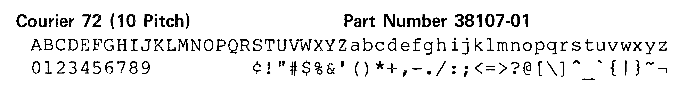

# Documentation and Diablo Print Wheels

It appears much of the DEC in-house and informal documentation uses a
monospace font which is tough for OCR to recognize. (See VCB-02 for an
example). It is _almost_ Courier, but not quite! It would be good to
get the actual font to train tesseract on. Hackerb9's current guess is
that DEC used the LQP01 printer with a **Diablo Courier 72** Print
Wheel.

## Nomenclature

The _DEC LQP01_ (Letter Quality Printer) is a modified Xerox Diablo
Model 1345 HyType II Serial Impact Printer.

10 and 12 in a typeface name refer to the "pitch", which is number of
characters per inch. Another option is PS, meaning "proportional
spacing". (Courier 72 is a 10-pitch font.)

## Print wheels, 96-petaled daisies, and solenoid hammers

Excerpt from LQP8-78 manual:

> "Each print wheel is 3 in. in diameter and resembles a
> daisy with 96 petals, one for each character. The letter E
> is the starting position of the wheel when the printer is
> initialized. The print wheel control logic computes the
> shortest distance and direction of movement to place the
> next character to be printed in front of the print hammer.
> On receipt of the first character, the print wheel rotates
> up to 3.14100 radians (180 degrees) in either direction,
> depending on the selected character location, and then
> stops. The print hammer hits the petal, with the result
> that the character is printed on the paper."

[_Note from hackerb9: the letter 'E' does not make sense as the start
position for the printer; it is not even in the top ten of initial
letters in English words. A quick grep of `/usr/dict/words` shows that
'S' would have been a better choice._]

### Standard DEC Printwheels for the LQP01

| Font       | Pitch | DIGITAL Part No. |
|------------|-------|------------------|
| Courier 10 | 10    | 36-13256-01      |
| Pica 10    | 10    | 36-13256-02      |
| Elite 12   | 12    | 36-13256-03      |
| Courier 72 | 10    | 36-13256-04      |

### Special Order DEC Printwheels

| Font Style            | Pitch | Font Style              | Pitch |
|-----------------------|-------|-------------------------|-------|
| APL10                 | 10    | Kana Gothic Pica 10     | 10    |
| British Pica 10       | 10    | Manifold 10             | 10    |
| Courier Legal 10      | 10    | OCR-A                   | 10    |
| Courier Legal 10A     | 10    | OCR-B                   | 10    |
| Forms Gothic S-10     | 10    | OCR-B Kana              | 10    |
| French Prestige Cubic | 10    | Pica Legal 10A          | 10    |
| General Scientific 10 | 10    | Prestige Elite Legal 12 | 12    |
| German Pica 10        | 10    | Scandia Elite 12        | 12    |
| Kana Gothic Elite 12  | 12    | UK Courier 10           | 10    |

### Xerox Diablo part numbers.

| Part No. | Description            || Part No. | Description                     |
|----------|------------------------||----------|---------------------------------|
| 38100-01 | Courier 10             || 38135    | Kana Gothic Elite 12 (thin Hub) |
| 38101-01 | Pica 10                || 38136    | Kana Gothic Pica 10 (thin Hub)  |
| 38102-01 | Elite 12               || 38137    | Kana Gothic Elite 12            |
| 38103    | Manifold               || 38138    | Kana Gothic Pica 10             |
| 38104    | Courier Legal 10       || 38139    | British Pica 10                 |
| 38105    | Prestige Elite Legal 12|| 38140    | UK Courier 10                   |
| 38106-02 | Dual Gothic Legal 12   || 38141    | General Scientific 10           |
| 38107-01 | Courier 72             || 38145    | OCR-B Kana 10                   |
| 38108    | Courier Legal 10A      || 38146    | OCR-B                           |
| 38109    | Pica Legal 10A         || 38147    | Forms Gothic S10                |
| 38131    | French Prestige Cubic  || 38150-01 | APL 10                          |
| 38132    | German Pica 10         || 38157    | German Elite 12                 |
| 38133    | Scandia Elite 12       || 38159    | European Elite 12               |

### Character Sets

Courier 10
ABCDEFGHIJKLMNOPORSTUVWXYZabcdefghijklmnopgrstuvwxyz
0123456789        £!"#$%&'()*+,-./:;<=>?@[\]^_`{|}~¬

Courier Legal 10 Part Number 38104-02
ABCDEFGHIJKLMNOPORSTUVWXYZabcdefghijklmnoparstuvwxyz
0123456789        ¢!"#$%&°()*+,-./:;§=†?@[®]©_'¼‗¶™½
0123456789               '          < >   \ ^ `{|}~¬

Courier Legal 10A Part Number 38108-02
ABCDEFGHIJKLMNOPQRSTUVWXYZabcdefghijklmnopqrstuvwxyz
0123456789        ¢!"#$%&'()*+,-./:;¼=½?@[®]©_°§¶†™‗
0123456789        ¢!"#$%&'()*+,-./:;<=>?@[\]^_`{|}~¬

Courier 72 (10 Pitch) Part Number 38107-01
ABCDEFGHIJKLMNOPORSTUVWXYZabcdefghijklmnopqrstuvwxyz
0123456789        ¢!"#$%&'()*+,-./:;<=>?@[\]^_`{|}~¬

Courier 10 U.K. Part Number 38140-01
ABCDEFGHIJKLMNOPORSTUVWXYZabcdefghijklmnopqrstuvwxyz
0123456789        ½!"₤$%&'()*+,-./:;<=>?@[\]^_`{|}~#

Courier 10 German Part Number 38156-01
ABCDEFGHIJKLMNOPORSTUVWXYZabcdefghijklmnoparstuvwxyz
0123456789        §!"₤$%&'()*+,-./:;<=>?ẞÄÖÜ^_`äöü~|

Courier 10 Titan
ABCDEFGHIJKLMNOPORSTUVWXYZabcdefghijklmnoparstuvwxyz
0123456789        [!"µ$%&'()*+,-./:;¼=½?@]£°¾_,.<²>³

## DEC LQP01 / Diablo HyType 1345A capabilities

* Uses plastic wheels only.
* Can use APL wheels.
* Prints 45 characters per second.

### Ooops, these were for Diablo 630, which I think is different, despite Wikipedia.
* Can use either plastic or metalized wheels.
* Can use Proportional Spacing, 10, 12, and 15-pitch.
* Can use 88, 92, or 96-character wheels.
* Over 200 different printwheels were available in 1982.

## Courier, Titan, P&P

Xerox/Diablo seem to have had many names for Courier.

* Courier 72
  * Plastic, Part Number 38107-01
	
  * This is the default wheel for the HyType 1345 (according to the
    maintenance manual), so it is most likely what DEC used in their
    documentation.

* Courier 10
  * Plastic, Part Number 38100-01
	
  * Compared to Courier 72
    * Has a slash through the zero.
	* `¢` replaced with `£`.

* Courier Legal 10
  * Plastic, Part Number 38104-02
	
  * Compared to Courier 72
	* Lacks `<`, `>`,`\\`, `\^`, \`,  `{`, `\|`, `}`, `~`, `¬`, 
	* Gains `§`, `†`, `®`, `©` , `°`, `¼`, `‗`, `¶`, `™`, `½`

* Courier Legal 10A
  * Plastic, Part Number 38108-02
	
  * Same characters as Legal 10, just scrambled on the wheel.

* Titan 10
  * Diablo 96 Metal, Part Number 311900-01
	
  * French Metal, Part Number 311687-01
	
  * German Metal, Part Number 311835-01
	
  * UK Metal, Part Number 311825-01
	
  * Spanish Metal, Part Number 311790-01
	
  * Norwegian/Danish Metal, Part Number 311801-01
	
  * Swedish Metal, Part Number 311810-01
	

* P & P #3
  * Xerox 96 Metal, Part Number 311912-01
	

### Non-ASCII characters on Courier variants

Courier 72, Courier 10, Courier Legal 10, Titan 10, and P&P #3 have
some extra glyphs that probably should be trained by the OCR as well.

| C 72 | C 10 | CL 10 | CL 10A | T 10 |
|:----:|:----:|:-----:|:------:|:----:|
| 0    | Ø    | 0     | 0      | 0    |
| ¢    | £    | ¢     | ¢      | [    |
| \'   | \'   | °     | \'     | \'   |
| <    | <    | §     | ¼      | ¼    |
| >    | >    | †     | ½      | ½    |
| \\   | \\   | ®     | ®      | £    |
| \^   | \^   | ©     | ©      | ¾    |
| \`   | \`   | \'    | °      | ,    |
| \{   | \{   | ¼     | §      | .    |
| \|   | \|   | ‗     | ¶      | \<   |
| \}   | \}   | ¶     | †      | ²    |
| ~    | ~    | ™     | ™      | \>   |
| ¬    | ¬    | ½     | ‗      | ³    |
| \#   | \#   | \#    | \#     | µ    |
| \[   | \[   | \[    | \[     | \]   |
| \]   | \]   | \]    | \]     | °    |

|   | Name             | C 72 | C 10 | CL 10/10A | T 10 |
|---|------------------|:----:|:----:|:----------|------|
| Ø | Zero slash       |      | ✓    |           |      |
| £ | British Pound    |      | ✓    |           | ✓    |
| ¬ | Negation         | ✓    | ✓    |           |      |
| ½ | One half         | ✓    | ✓    | ✓         | ✓    |
| ¼ | One quarter      | ✓    | ✓    | ✓         | ✓    |
| ° | Degree           | ✓    |      | ✓         | ✓    |
| ¢ | Cents            | ✓    |      | ✓         |      |
| † | Dagger           | ✓    |      | ✓         |      |
| © | Copyright        | ✓    |      | ✓         |      |
| ® | Registered       |      |      | ✓         |      |
| ™ | Trademark        |      |      | ✓         |      |
| § | Section          |      |      | ✓         |      |
| ¶ | Paragraph        |      |      | ✓         |      |
| ‗ | Double underline |      |      | ✓         |      |
| µ | Mu / Micro       |      |      |           | ✓    |
| ¾ | Three quarters   |      |      |           | ✓    |
| ² | Superscript 2    |      |      |           | ✓    |
| ³ | Superscript 3    |      |      |           | ✓    |
