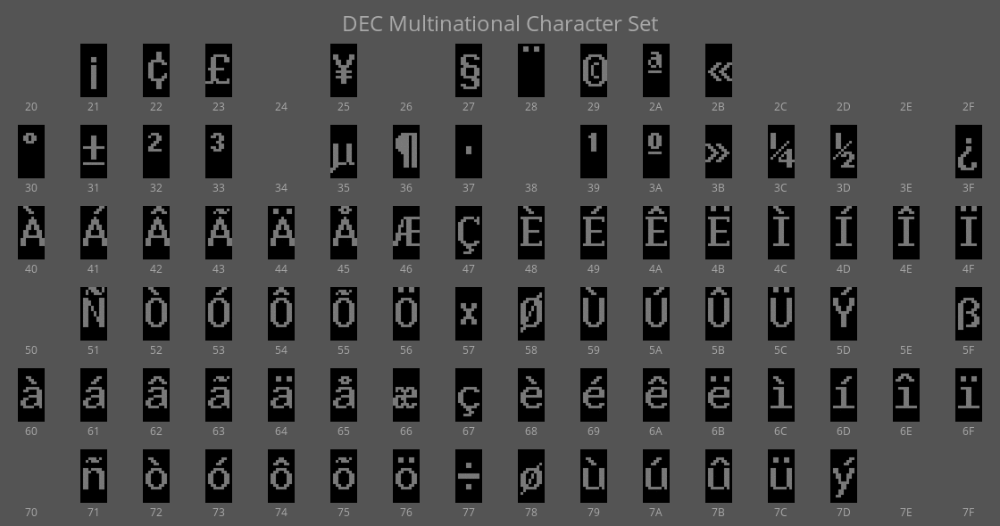
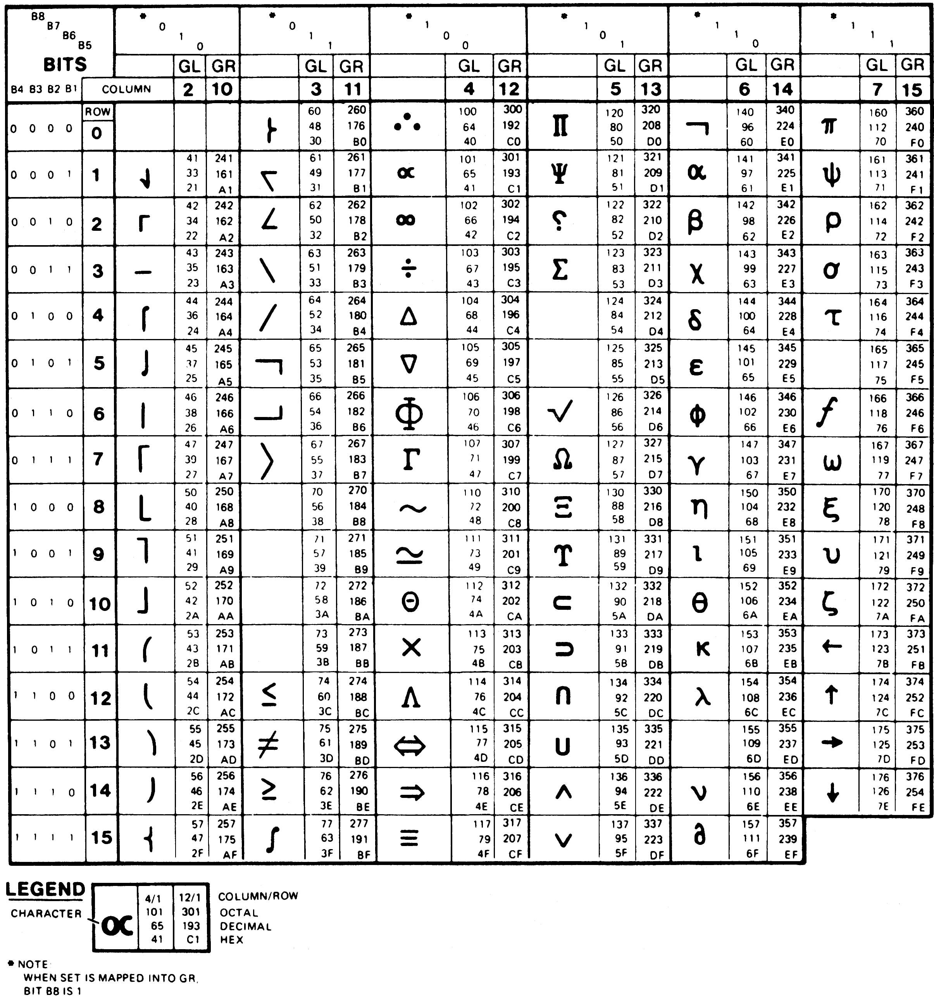
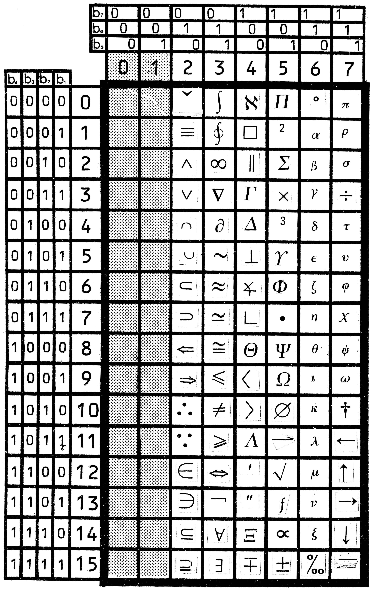

# Relevant standards

This page contains the standards the VT340 Text Programming Reference
Manual lists the terminal as being compatible with.

Some of DEC's documentation, particularly for character encodings and
escape sequences, doesn't make much sense without seeing the standards
they were constrained by. 

Note that each standard has multiple names, being published by
different entities. ECMA (the European Computer Manufacturer's
Association) versions are preferred they are available at no cost,
unlike ISO (the International Standards Organization), which keeps
their documents behind a paywall.

## ANSI-x3.64: _The_ ANSI Standard for Escape Sequences

* ANSI x3.64 is equivalent to ISO-6429, ECMA-48, and FIPS Pub. 86.
* [ANSI-X3.64 (1979)](ANSI-X3.64-1979.pdf) - Contemporary when VT340
  was being designed.
* [ECMA-48 (1991)](ECMA-48_1991.pdf) - Final version.

This standard was so ubiquitous in the 1980s that even now, decades
later, the phrase "ANSI codes" means this document. This is the
standard that describes how valid escape sequences can be formed,
defines the meaning for some sequences, and specifies how private
extensions can be made.

See also: Hackerb9 has created a table of all ["ANSI" SGR Graphic
Renditions](graphicrenditions.md) -- bold, italic, and so on -- from
the ANSI standard, including which ones are supported by the VT100,
VT340, or XTerm.

## ANSI X3.4 (1977): American Standard Code for Information Interchange (ASCII)

## ISO 646-1977: International ASCII

* ISO 646 is identical to ECMA-6 and CCITT Rec V.3 (Alphabet 5).
* ISO 646-1973 - Original international standardization,

## ISO 2022-1986: Multilingual Code Extension Techniques.

* ISO 2022 is the same as ANSI-X3.41, ECMA-35, and FIPS Pub 35.
* [ECMA-35 (1985)](ECMA-35_1985.pdf) - Contemporary with VT340. 
  Verbatim identical to ISO 2022-1986.
* [ANSI-X3.41 (1974)](ANSI-X3.41-1974.pdf) - Original standard.
  (Technically, [ECMA-35 (1971)](ECMA-35_1971.pdf) was the
  _original_-original, but ANSI's typesetting is easier to read.)
* [ECMA-35 (1994)](ECMA-35_1994.pdf) - Final version.

This is the standard that explains how to use characters from other
languages via "shifting" to replace sections of the 8-bit character
set.

## dpANS X3.134.1: 8-Bit ASCII structure and rules

## dpANS X3.134.2: ASCII supplemental multilingual graphic character set

## ISO 6429-1983: Additional Control Functions for Character Imaging Devices

## ISO 8859-1-1987: Latin Alphabet Nr 1.

[Latin-1](IR100-Latin-1.pdf) appears to be a codification of DEC's
Multilingual Character Set (MCS) with a few minor changes.

## ISBN 2-12-953907-0: IR

* [ISO International Register](ISO_IR_Character_Set_Registry_2004.pdf) (mirrored from https://itscj.ipsj.or.jp/english/)

The full name is _International Register of Coded Character Sets to be
used with Escape Sequences_, but we'll just call it "IR". 

Not technically a standard, the IR is a list of the ISO 2022 character
sets in use around the world and what escape sequences are used to
activate them. Beyond the escape codes built-in to the North American
VT340, DEC released localized VT340s for markets -- such as Hebrew,
Korean, and Russian -- that may have used these sequences to select
the proper character set.

### "Compliance" and the Column 3 Exception

The VT340 manual claims it is compliant with the IR and that is true,
in a sense. However, much of what is in accord with the IR are the
dozen [National Replacement](../../charset/nrc.md) character sets
which DEC has deprecated and disabled by default. [XXX double check
this].

Of the six remaining, non-NRC, character sets that the VT340 offers,
only two of them are the same as in the International Register:
[ASCII](IR006-ASCII.pdf) and [Latin-1](IR100-Latin-1.pdf).

The other four use final characters that are in "column 3" (between 30
and 3F): DEC Supplemental Graphic, User-preferred, DEC Special
Graphic, and DEC Technical. ISO-2022 reserves column 3 for "private
use", with a warning about using it.

Click to see more about standards compliance.

#### What ISO 2022 Says

<blockquote>
The use of escape sequences is specified in this Standard. However,
escape sequence with Final characters from column 3 are reserved for
private use subject to the categorization outlined below. Escape
sequences for private use are not subject to registration under ISO
2375.

NOTE: _The implementors of any private escape sequence described as
such in this Standard are alerted to the fact that other implementors
may give different meanings to the same escape sequence or may use
different escape sequences to mean the same thing. Furthermore, such
meanings may subsequently be assigned to registered escape sequences.
Interchanging parties are warned that the use of such private escape
sequences may reduce their capability to interchange data subsequently._
</blockquote>

#### Could DEC have used standard character sets?

On the surface, it looks like some of DEC's standards-_compliant_
non-standard character sets could have been replaced with ones that
are actually in the International Registry. However, they had features
that were not in any of the standards.

DEC Technical, for example, is very similar to the IR's [Technical
Set](IR143-Technical-Set.pdf), released in 1988.

 

IR143 is missing the extra large mathematical symbols, such as the
multipart summation sign that is in DEC Technical:

 

  <i>The whole is greater than the summation of its parts.</i> 
 

 

In fact, none of the standards in the IR appear to contain components
designed for composing into larger characters. It is a mysterious
lack. Even if DEC did not want to standardize their Technical
Character Set, wouldn't some other organization do so? 

If there was an unspoken rule, it was not that glyphs may only connect
one dimensionally. There is a character set ([IR155,
1990](IR155-BoxDrawing.pdf)) just for box drawing characters to make
2-D diagrams. (The first glyphs which are clearly made to connect
vertically are the line drawing characters in
[IR058](IR058-Chinese.pdf), from 1982. They were included wholesale in
a package of 7445 characters from another standard, GB 2312-80.)

