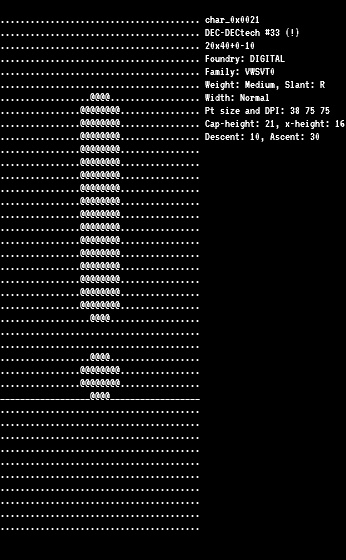
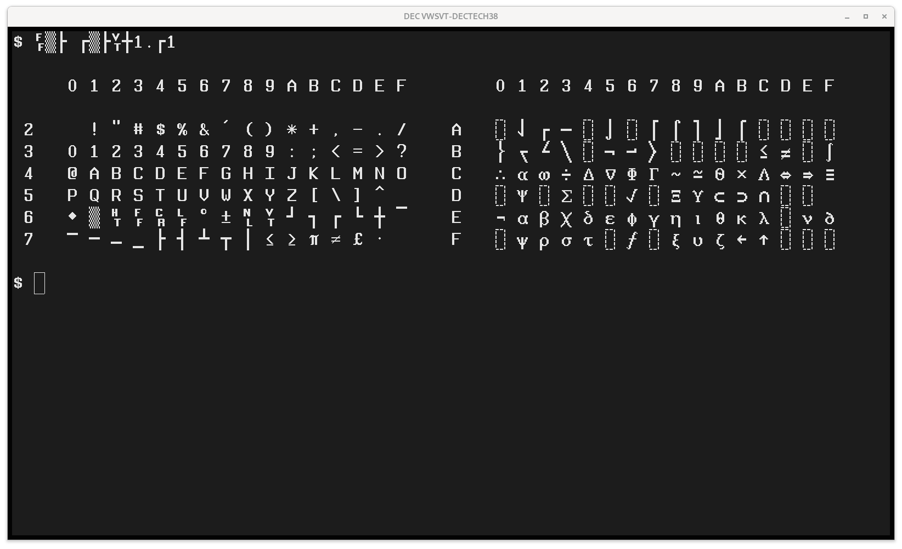

# VWSVT font




This bitmap font was included on DEC's Freeware CD for VMS v4.0. It
includes several bitmap terminal fonts that are meant to be used
together to make a single typeface.

The files are in [PCF](pcf) bitmap format with a [BDF](bdf) version
added for convenience. If you want a quick peek at the fonts without
installing them, you can preview them in glorious ASCII art in the
[txt](txt) directory.

### Fonts in this typeface

* Weight: medium or bold
* Width: narrow, normal, wide, or double-wide
* Height: normal or double-height
* Encoding: Latin-1 or DEC Technical

### Filenames

Note that vwsvt0-38.pcf and vwsvt0-bold38.pcf had been switched in the
original distribution from DEC and have been corrected by hackerb9.

| Filename<BR>vwsvt0-\_\_.pcf                                     | Weight<br>(Default: Medium) | DECDHL, DECDWL Size<br>(Default: Single) | Columns<br>(Default: 80) | Character Set<br>(Default: Latin-1) | Cell Size |
|-----------------------------------------------------------------|-----------------------------|------------------------------------------|--------------------------|-------------------------------------|-----------|
| [19](pcf/vwsvt0_19.pcf)                                         |                             |                                          |                          |                                     | 10x20     |
| [narrow19](pcf/vwsvt0_narrow19.pcf)                             |                             |                                          | 132                      |                                     | 6x20      |
| [wide19](pcf/vwsvt0_wide19.pcf)                                 |                             | ?Single-height, double-width?            | ?132?                    |                                     | 12x20     |
| [dblwide19](pcf/vwsvt0_dblwide19.pcf)                           |                             | Single-height, double-width              |                          |                                     | 20x20     |
| [bold19](pcf/vwsvt0_bold19.pcf)                                 | Bold                        |                                          |                          |                                     | 10x20     |
| [bold_narrow19](pcf/vwsvt0_bold_narrow19.pcf)                   | Bold                        |                                          | 132                      |                                     | 6x20      |
| [bold_wide19](pcf/vwsvt0_bold_wide19.pcf)                       | Bold                        | ?Single-height, double-width?            | ?132?                    |                                     | 12x20     |
| [bold_dblwide19](pcf/vwsvt0_bold_dblwide19.pcf)                 | Bold                        | Single-height, double-width              |                          |                                     | 20x20     |
|                                                                 |                             |                                          |                          |                                     |           |
| [dectech19](pcf/vwsvt0_dectech19.pcf)                           |                             |                                          |                          | DEC Graphics, Tech                  | 10x20     |
| [narrow_dectech19](pcf/vwsvt0_narrow_dectech19.pcf)             |                             |                                          | 132                      | DEC Graphics, Tech                  | 6x20      |
| [wide_dectech19](pcf/vwsvt0_wide_dectech19.pcf)                 |                             | ?Single-height, double-width?            | ?132?                    | DEC Graphics, Tech                  | 12x20     |
| [dblwide_dectech19](pcf/vwsvt0_dblwide_dectech19.pcf)           |                             | Single-height, double-width              |                          | DEC Graphics, Tech                  | 20x20     |
| [bold_dectech19](pcf/vwsvt0_bold_dectech19.pcf)                 | Bold                        |                                          |                          | DEC Graphics, Tech                  | 10x20     |
| [bold_narrow_dectech19](pcf/vwsvt0_bold_narrow_dectech19.pcf)   | Bold                        |                                          | 132                      | DEC Graphics, Tech                  | 6x20      |
| [bold_wide_dectech19](pcf/vwsvt0_bold_wide_dectech19.pcf)       | Bold                        | Single-height, double-width?             | 132?                     | DEC Graphics, Tech                  | 12x20     |
| [bold_dblwide_dectech19](pcf/vwsvt0_bold_dblwide_dectech19.pcf) | Bold                        | Single-height, double-width              |                          | DEC Graphics, Tech                  | 20x20     |
|                                                                 |                             |                                          |                          |                                     |           |
| [38](pcf/vwsvt0_38.pcf)                                         |                             | Double-height, double-width              |                          |                                     | 20x40     |
| [narrow38](pcf/vwsvt0_narrow38.pcf)                             |                             |                                          | 132                      |                                     | 12x40     |
| [bold38](pcf/vwsvt0_bold38.pcf)                                 | Bold                        | Double-height, double-width              |                          |                                     | 20x40     |
| [bold_narrow38](pcf/vwsvt0_bold_narrow38.pcf)                   | Bold                        | Double-height, double-width              | 132                      |                                     | 12x40     |
|                                                                 |                             |                                          |                          |                                     |           |
| [dectech38](pcf/vwsvt0_dectech38.pcf)                           |                             | Double-height, double-width              |                          | DEC Graphics, Tech                  | 20x40     |
| [narrow_dectech38](pcf/vwsvt0_narrow_dectech38.pcf)             |                             | Double-height, double-width              | 132                      | DEC Graphics, Tech                  | 12x40     |
| [bold_dectech38](pcf/vwsvt0_bold_dectech38.pcf)                 | Bold                        | Double-height, double-width              |                          | DEC Graphics, Tech                  | 20x40     |
| [bold_narrow_dectech38](pcf/vwsvt0_bold_narrow_dectech38.pcf)   | Bold                        | Double-height, double-width              | 132                      | DEC Graphics, Tech                  | 12x40     |


## Usage

You can run the `dir2alias` script in this directory to create the
fonts.alias file and add the directory to the X11 font path.

The fonts.alias file exists to allow for short names, so one can use
"vwsvt0-dblwide19" instead of
"-digital-vwsvt0-medium-r-double*wide--20-190-75-75-c-200-iso8859-1"

Note that some applications will not show the font by default as it is
a bitmap, not scalable. For example, one may need to disable scalable
font rendering in xterm.

```
xterm -fn vwsvt0-19 -xrm 'xterm*renderFont: False'
```

### Character encoding

Encoding is in Latin-1 (and "DEC" for graphics) which both use 8-bit
characters from 128 to 255 and are thus incompatible with Unicode.
You'll need to set your shell's encoding to Latin-1 to have them
display correctly — e.g., `export LANG=en_US.iso8859-1`. Not all
systems include Latin-1 support by default. For example, on Debian
GNU/Linux, you'll need to uncomment the line that says
`en_US.ISO-8859-1` in the file /etc/locale.gen and then run
`locale-gen`.

Note that the "dectech" fonts include the DEC Special Graphics font in
G0 (7-bit ASCII) and Dec Technical Character Set in G1 ("high ASCII").




## Installation

You can copy the [pcf](pcf) directory to
/usr/local/share/fonts/vwsvtfont then add the directory to your
system's font search path. For example, for X11, you can use:

```bash
xset fp+ /usr/local/share/fonts/vwsvtfont
xset fp rehash
```

## History

This font was created by DEC and given away as "freeware". DEC
recommended it for use on their VT340 emulator, DECTerm, in order to
have the correct proportions for ReGIS graphics.

These .pcf files were extracted from dxfont_axp_vwsvt0_pcf010.a, which
was downloaded from: https://www.digiater.nl/openvms/freeware/v40/vwsvt/

The .a extension indicates the file is an OpenVMS Backup Saveset
archive. To extract it, hackerb9 used a program called vmsbackup which
is available from: ftp://ftp.process.com/vms-freeware/free-vms/

