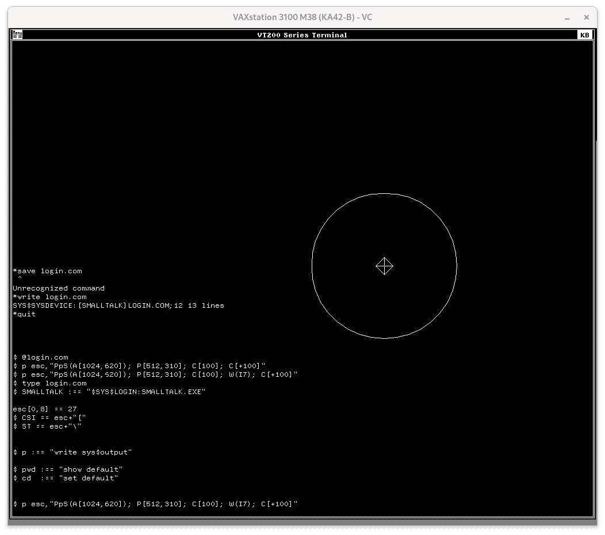

# The VAX Window System VT200 emulator

Apparently, before [DECterm](decterm.md) running on DECwindows, DEC
released a VT200 emulator on a peculiar windowing system called VWS
("Vax Workstation Software Windowing System"). There are two things
interesting about this emulator, from a VT340 perspective.

First, [its font](fonts/vwsvtfont) is 10x20 which makes it
a reasonable — if not quite as aesthetically pleasing — drop in
replacement for the VT340's font. 

Second, this "VT200" emulator's ReGIS and sixel graphics supports 256
colors, which is more colors than any other terminal from DEC (that I
know of).

| Terminal        | # colors | palette | sixel | ReGIS | Resolution  | year  |
|-----------------|----------|---------|-------|-------|-------------|-------|
| GIGI/VK100      | 8        | -       | -     | Y     | 768 x 240   | 1980  |
| VT125           | 4        | -       |       | Y     | 768 x 240   | 1981  |
| DECwriter IV    | 2        | -       | Y     | -     | 72 dpi      | 1981  |
| Rainbow Med Res | 16       | 4096    | -     | Y     | 384 x 240   | 1982  |
| Rainbow Hi Res  | 4        | 4096    | -     | Y     | 800 x 240   | 1982  |
| VT241           | 4        | 64      | Y     | Y     | 800 x 240   | 1984  |
| VWS VT200       | 256      | ?       | y¹    | y¹    | 1024 x 620² | 1987? |
| VT340           | 16       | 4096    | Y     | Y     | 800 x 480   | 1988  |
| DECterm         | 16       | ?       | Y     | Y     | 800 x 480   | 1989  |

1. The VWS VT200 could display sixel and ReGIS graphics, sort of.

	

   There seem to actually have been two different programs: the sixel
   version (with a white background) and the ReGIS version (with a
   black background). The ReGIS version claims to support both (when
   enquired with `write sys$output
   f$getdvi(f$getjpi("","terminal"),"tt_sixel")`), but I don't see
   anything actually drawn when running VWS in `simh`. Also ReGIS
   opens up a separate command display window instead of prompting at
   the bottom of the terminal as the VT340 does, but it doesn't work
   correctly. All the ReGIS commands I type are interpreted by VMS,
   not ReGIS! (Okay, it is probably working exactly as it should, but
   it doesn't work the way the VT340 does).
	

2. VWS's vertical resolution for ReGIS seems lower than the 864 pixels
   claimed online. 

	

   
   To come up with the number "620 pixels", I did some experiments
   with remapping the coordinate system using `S(A[0,0][1024,864])`.
   By using the 'V' (Vector) command and pressing the number keys, I
   was able to move the graphics cursor and notice how often the
   centerline didn't actually shift. By multiplying the ratio to the
   previous guess, I got progressively closer estimates.

   

<ul><i>

“The red, green and blue data areas in the Color Map should be loaded
with all F's to reduce any unnecessary radio frequency emissions.”

</i>

---Rainbow Color Graphics Option Programmers Reference Guide, Jun 1984

</ul>
