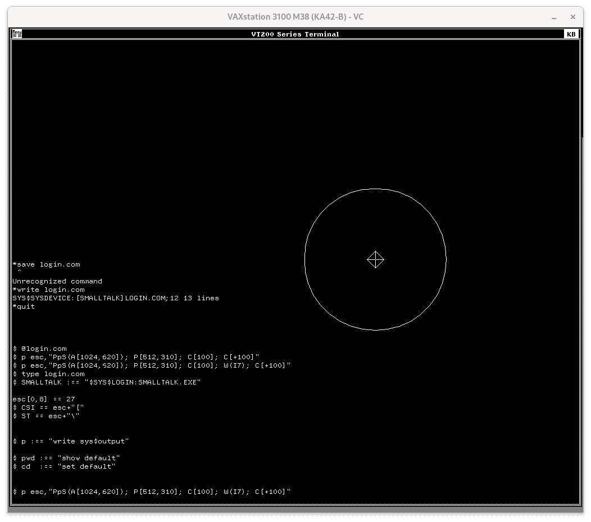
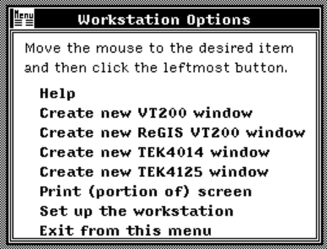
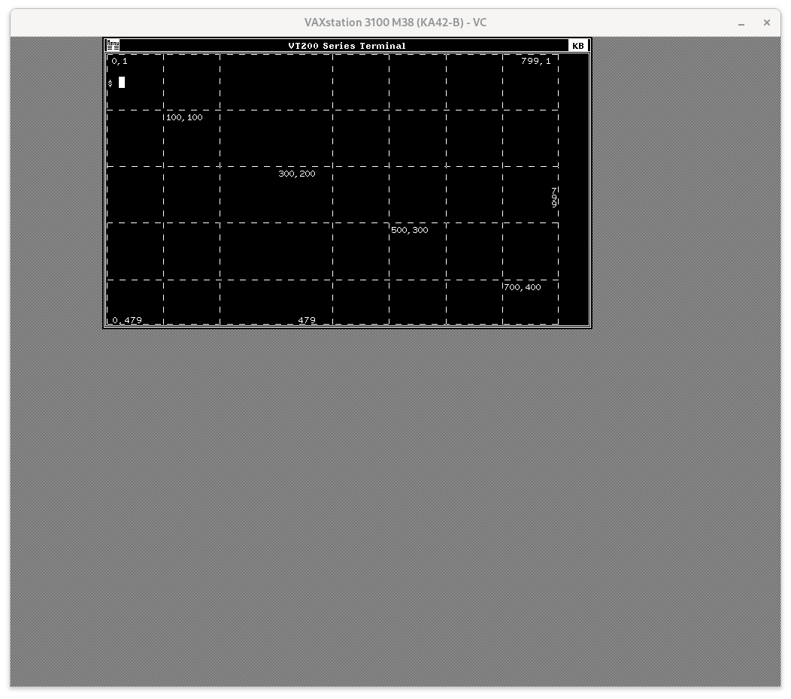
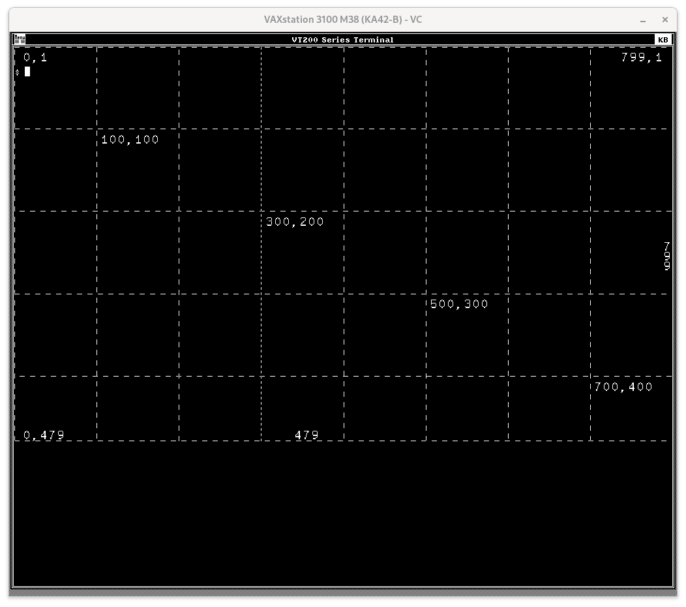
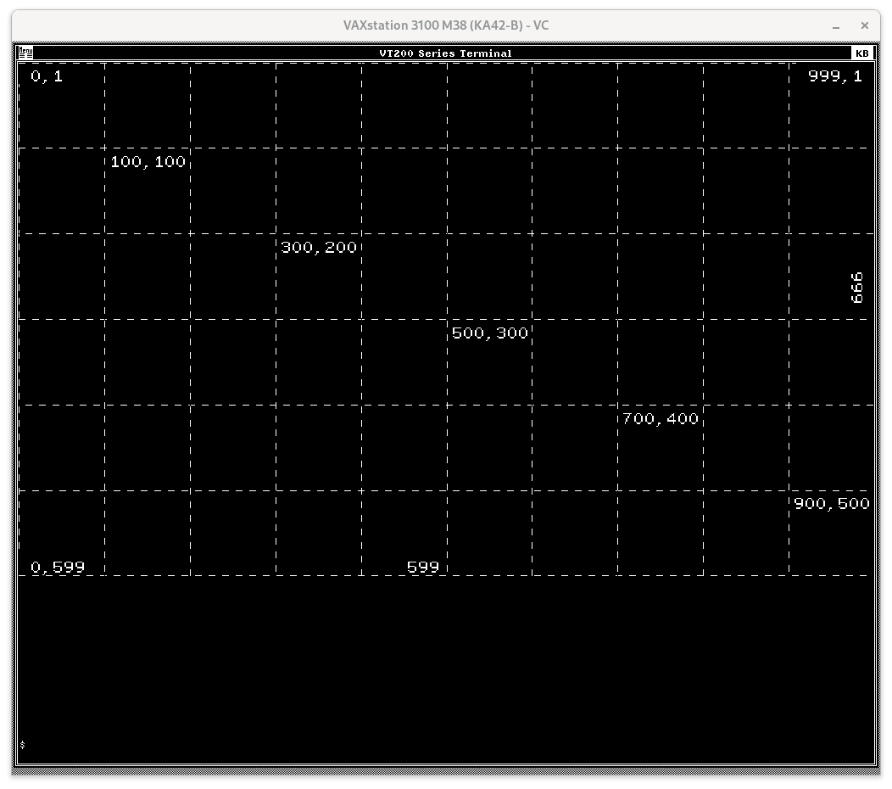

# The VWS VT200 emulator

Apparently, before [DECterm](decterm.md) running on DECwindows, DEC
released a VT200 emulator on a peculiar windowing system called _VWS_
("Vax Workstation Software Windowing System"). There are a few things
interesting about this terminal emulator, from a VT340 perspective.

## Portable Font

The VWS VT200 font is 10x20 which makes it a reasonable — if not quite
as aesthetically pleasing — drop in replacement for the VT340's font.
Especially since DEC released it in a [bitmap format](fonts/vwsvtfont)
that can be used on other machines. The bitmaps include double-wide
and double-size versions, the DEC Special Graphics, and Technical
Character Set. 

## 256 Colors

This terminal is
[documented](http://www.bitsavers.org/pdf/dec/vax/vms/vms_workstation/AA-MI67A-TE_A_Guide_to_Migrating_VWS_Applications_to_DECwindows_Sep1989.pdf)
as supporting 256 color graphics, which is more colors than any other
terminal from DEC (that I know of).

<ul>

| Terminal        | # colors | palette | sixel | ReGIS | Resolution  | year  |
|-----------------|----------|---------|-------|-------|-------------|-------|
| GIGI/VK100      | 8        | -       | -     | Y     | 768 x 240   | 1980  |
| VT125           | 4        | -       |       | Y     | 768 x 240   | 1981  |
| DECwriter IV    | 2        | -       | Y     | -     | 72 dpi      | 1981  |
| Rainbow Med Res | 16       | 4096    | -     | Y     | 384 x 240   | 1982  |
| Rainbow Hi Res  | 4        | 4096    | -     | Y     | 800 x 240   | 1982  |
| VT241           | 4        | 64      | Y     | Y     | 800 x 240   | 1984  |
| VWS VT200       | 256      | ?       | y¹    | y¹    | 1000 x 600² | 1987? |
| VT340           | 16       | 4096    | Y     | Y     | 800 x 480   | 1988  |
| DECterm         | 16       | ?       | Y     | Y     | 800 x 480   | 1989  |

1. The VWS VT200 could display both sixel and ReGIS graphics, sort of.

    <ul>
	

	

   There seem to actually have been two different programs: "VT200
   window" (with a white background) and "ReGIS VT200 window" (with a
   black background). 
   
   * The normal "VT200 window" claims to support sixel (when enquired
   with `write sys$output f$getdvi( f$getjpi("","terminal"),
   "tt_sixel")`), but not ReGIS. Testing shows that to be correct.

   * The ReGIS version, however, claims to support both, but it
   doesn't actually display sixels in my tests. (I am running VWS in
   simulation using `simh`, so that may be part of the problem.)
   
   
 </ul>
    

2. The resolution is 800x480 by default when a VT200 ReGIS terminal is
   first opened. However, in my tests, the maximum actual resolution
   can be increased to 1000x600. Resizing the VT200 window to
   full-screen is a necessary first step, but is not sufficient.
   ReGIS's coordinate system remains at 800x480 as seen here:
   
   <ul>
   

   
   

	The second step to change the resolution is to use the ReGIS command
   `S[0,0][999,599]` to set the coordinate system.

   

   
 
How do I know it is 1000x600?

   
   Ask a boring question, get a boring answer. ☺

   Varying the values for width and height in `S[0,0][`_w_`][`_h_`]`,
   I programmatically drew a grid using ReGIS on every other line.
   When the logical width was higher than 1000 or the height was over
   600, it was easy to see that two lines would be next to each other
   with no gap.

   

	 

   

   </ul>

</ul>

## Strangenesses

These are oddities I've found about the VT200 terminal that are
perhaps bugs or perhaps just an error in my method of testing. 

<ul>

*  Using the argument 2 or 3 in the DCS string for ReGIS opens up a
   separate command display window instead of prompting at the bottom
   of the terminal as the VT340 does. One can see the command and even
   type in ReGIS commands in the "interactive" window (after clicking
   in it), but anything typed is still interpreted by VMS! That nearly
   made it useless for me, but I could work around it by typing on a
   single line and then hitting <kbd>Ctrl</kbd><kbd>U</kbd> to clear
   the line and return to typing in the VT200 window. The trick is to
   not hit the <kbd>Enter</kbd> key as anything VMS prints as an error
   message will _also_ be interpreted as ReGIS commands.

* While the VWS VT200 terminal can be resized to nearly the full
  1024x1024 size of a VAXstation's display, ReGIS will only use the
  top half, stopping at 600 pixels for the Y-axis. It is not clear why
  this was desirable. Perhaps it has to do with aspect ratio -- both
  800x480 and 1000x600 are a 5:3 ratio. But I don't see a convincing
  argument for why.

* ReGIS cannot display data on horizontal line 0 by default. As far as
  I can tell, the default grid actually goes from [0,1] to [799,479].

* When the ReGIS screen coordinates are set to 1000x600, vertical line
  999 is invisible. (That's in addition to horizontal line 0 having
  gone missing.) Something peculiar is going on in the margins.

* Regis vertical line 300 is rather nonsensical in both 800x480
  and 1000x600. Sometimes it shows up just fine, but other times it
  disappears, is solid when it should be dashed, has the wrong dash
  pattern, or is shown as negative.

* Font size 0 (`T(S0)`) is actually just half-height text (`T(H1)`).

* Gigi's capacity to specify the font cell size directly
  (`T(S[10,20])`) is not implemented. This is unfortunate since the
  ReGIS font gets larger and uglier when the screen resolution is
  increased. There is no obvious way to correct it. ReGIS has many
  tools for magnifying the fonts, but none for shrinking them.
  
   
 

</ul>

I was unable to test colors because the VAXstation simulator I am
using does not yet support the color graphics card. ("Dragon", which
just happens to be the same chips used in the VT340!)

<ul><i>

“The red, green and blue data areas in the Color Map should be loaded
with all F's to reduce any unnecessary radio frequency emissions.”

</i>

---Rainbow Color Graphics Option Programmers Reference Guide, Jun 1984

</ul>
