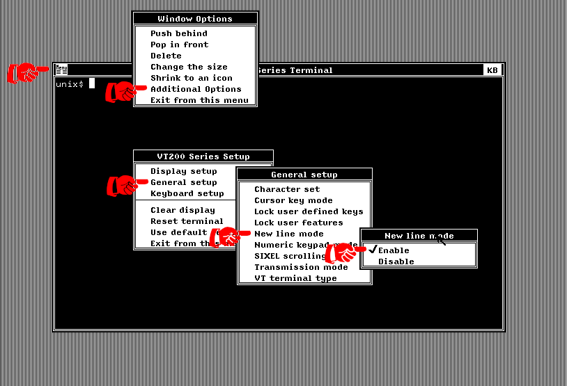

# Connecting the VWS VT200 terminal to a shell on the host

The following methods have been tested on a UNIX host. YMMV if you use
something else.

## On the VMS side

While one can do it by setting up DECnet or SLIRP networking, the
easiest methods I've found so far rely on SIMH's ability to map a
serial device to a TCP port. To do so, one can add this to the
simh.ini file:

```ini
; DZ11 has four serial ports. Make TTA3 accessible on TCP 6666.
; (MicroVAX uses first two for kbd & mouse)
SET DZ LOG=0=serial0.log
ATT DZ LINE=3,6666
```

Then, in VMS, one can connect the VWS terminal to the serial port by
typing

```dcl
SET HOST /DTE TTA3
```

## On the host side

There are multiple methods of connecting a shell to the port opened by
SIMH (TCP port 6666 in the example above). The top two are using
telnetd and using filedescriptor redirection.

### Option 1. Telnetd (hackerb9's current favorite)

Using telnetd has the benefit of creating a pseudoterminal so that
programs which require a tty will run correctly. It also allows ^C
(break) and ^Z (suspend) to work (mostly) correctly.

The downside is that it requires running telnetd on the host computer.

1. Install telnetd on the localhost (TCP port 23)
2. Connect the ports using shell redirection
  ```
  exec 23<>/dev/tcp/localhost/23
  exec 6<>/dev/tcp/localhost/6666
  cat <&6  >&23 & 
  cat <&23 >&6  &
 ```

### Option 2. Run a subshell and redirect I/O

This is simplest as it doesn't require any extra software. However, it
does not provide a tty, which means that some programs will fail or
refuse to run.

1. Connect TCP port 6666 to filedescriptor 6

   ```
   exec 6<>/dev/tcp/localhost/6666
   ```

2. Discard SIMH's TELNET negotiation characters and banner.

   ```
   while ! read -t0 <&6; do echo -n .; sleep 0.1; done
   while read -t0 <&6; do read <&6; echo "REPLY: $REPLY"; done
   ```

3. Run `bash` with its I/O set to filedescriptor 6.
   ```
   TERM=vt220 LANG=C bash -i <&6 >&6 2>&6
   ```

4. Fix the newlines so text doesn't run off the right side. The
   simplest way is to use the VMS VWS menus.

   1. Click on the "MENU" icon on the top left of the VWS VT200
   terminal.
   2. Select "Additional Options"
   3. Select "General setup"
   4. Select "New line mode"
   5. Select "Enable"

   

