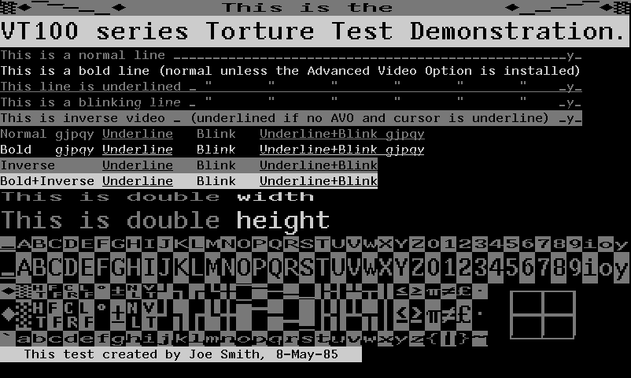

## Demos from the MS Kermit source code

These demonstration files show off terminal emulator support of the MS
Kermit terminal emulator program circa 1990 which was VT320 compatible
with some VT340 extensions. Of particular interest to us are the TEK
4010 and sixel graphics. (Note that there are no REGIS tests as, unlike
a true VT340, Kermit did not support Regis graphics.)

Most of the demo files can just be `cat`ed to the screen. The one
exception is tek.c which generates tek.tst (which gets `cat`ed). 

### [DEMO.TEK](../../../raw/main/kermitdemos/DEMO.TEK)

Combination of tek and sixel drawing created by WordPerfect. Does not
work on a genuine VT340.

Note that this file appears to be using sixels _within_ TEK mode,
which should not work since The VT340 manual states that _"The
terminal ignores any other escape sequences received in [4010/4014]
mode."_ Oddly, Kermit appears to be trying to be compatible with
WordPerfect 5.0 (VMS/Ultrix) which used the VT340's graphics
capabilities to preview figures and pages. Is it possible some other
DEC terminal did allow mixing and TEK and escape sequences? Or was
this file created just for Kermit?

> by Joe Doupnik » Tue, 09 Jan 1990 09:52:43
>
>         In a week or so, +/-, Columbia Univ will announce MS Kermit 3.0 which
> has support for WordPerfect/VMS/Ultrix 5.0, especially providing figure and
> page previewing in full graphics mode on the IBM PC machine. While the terminal
> emulator is listed as a VT320 it has the Sixel material of VT340's and is
> designed to work smoothly with WP/5. That means one can run WP on the VAX and
> let users do all the normal things from their PC, and use the standard PC
> template for WP. There is an accompanying file, named WP30.INI, which sets up
> the keyboard for WP and has extensive comments about what it does and how
> to change it. MSK 3.0 also can dump a graphics screen in TIFF 5 format for
> importation into WP and the standard D.T.Pub. programs.
>         This version of Kermit is in beta test now and will surface formally
> within two weeks. Expect the usual crunch on Bitnet channels when this
> happens.
>         Joe D.

### [DEMO.SIX](../../../raw/main/kermitdemos/DEMO.SIX)

 

A version of DEMO.TEK modified by hackerb9 to only contain sixel
graphics, no TEK commands.

Note that the original Kermit demo presumes
[DECSDM](https://github.com/dankamongmen/notcurses/issues/1782) 
(Sixel Display Mode) is on, which is always true for MS Kermit. The
escape sequence to enable (`Esc [ ? 80 h`) and disable 
(`Esc [ ? 80 l`) DECSDM have been added at the beginning and end 
of the file.

Also, the demo presumes that pixels are always square, which is not
actually the default for sixels. For that reason, the previously
omitted _Macro_ parameter in each sixel header was changed to "9"
to select 1:1 pixels (`Esc P 9 ; 1 ; q`).

Note that this file is a good example of the persistence of the sixel
palette. There are technically 16 sixel images in this file and the
palette is set in the first, used in the the next 14, then changed in
the last which updates the colors previously drawn.

### [CHARDEMO.VT](../../../raw/main/kermitdemos/CHARDEMO.VT)

Show all character sets available on this terminal. (Including "Technical") 
This file originally started with `Esc c`, but that causes a genuine
VT340 to reboot, so they have been replaced with `Esc [ H Esc [ J`
which clears the screen.

### [COLORS.VT](../../../raw/main/kermitdemos/COLORS.VT)

Test ANSI colors which works with Kermit, but shows up as black and
white on a genuine VT340.

### [FEATURES.VT](../../../raw/main/kermitdemos/FEATURES.VT)

 

Joe Smith's VT100 series text torture test. Double-width,
double-height, blinking, underlining, box drawing chars. This doesn't
work very well on Kermit, but works perfectly on the VT340.

Starts out with a slow, smooth scroll of text that most terminal
emulators blaze past faster than the eye can see.

### [USA.TEK](../../../raw/main/kermitdemos/USA.TEK)

A vector map of the USA. The original file did not start with turning
on Tektronix mode, so that has been added: `Esc [ ? 38 h`. Note that this
file switches out of Tektronix mode at the end, so the map will be
erased as soon as it finishes drawing.

### [tek.c](../../../raw/main/kermitdemos/tek.c)
### [tek.tst](../../../raw/main/kermitdemos/tek.tst)

A C program that generates a TEK file that does some basic line
drawing tests. Nothing terribly complicated.

The [original tek.c](../../../raw/main/kermitdemos/tek.c.orig) wrote to the file
tek.tst, but that was inconvenient. Hackerb9 modified tek.c so that it
outputs the TEK file directly to stdout. Additionally, if given the -P
option, it uses the Tektronix hardcopy command (`Esc ^W`) to send the
graphics to the printer port in sixel format. By connecting the
VT340's printer port to another serial port on the host, the file can
be capture for a screenshot. [tek.six](../../../raw/main/kermitdemos/tek.six)

`gcc tek.c -lm && ./a.out -P`

This program shows some differences between the way Kermit implemented
Tek 4010/4014 emulation and the way DEC did.

* According to the Kermit document [TEKEMU.TXT](TEKEMU.TXT), in
  addition to using DEC private mode #38 to enter Tek mode, Kermit
  recognizes the Tek clear screen command, `Esc ^L`. That explains why
  this program did not work initially on a VT340 and just dumped a
  bunch of ASCII gobbledygook on the screen. Hackerb9 had to add `Esc
  [ ? 38 h` to enter Tek mode at the beginning and `Esc [ ? 38 l` to
  exit at the end.

* Note that the ANSI color codes Kermit is using do not work on a
  VT340. This appears to be a Kermit extension. As mentioned above for
  DEMO.TEK, the VT340's Tek mode is wholly separate from normal
  operation and the terminal (mostly) ignores any non-Tek escape
  sequences received. The exception is when in Tek's "Alpha mode"
  (`Esc ^_`) in which the alphanumeric portion of any non-Tek escape
  sequence is printed to the screen literally. This is why ";33m" shows
  up after the words "shallow fan" on a VT340.

* The appear to be an extraneous line before the first fan and a dot
  before the words "The end." That is likely due to the ANSI color
  codes.

## Heathkit graphics

Kermit's .HGR files are not useful for VT340 testing as they are for
Heathkit H19 emulation. Nevertheless, they may be of interest, so here
are the two HEATH demonstration files that were in the Kermit source
code.

### [CASTLE.HGR](../../../raw/main/kermitdemos/CASTLE.HGR)
### [PATTERN.HGR](../../../raw/main/kermitdemos/PATTERN.HGR)
<!-- ### [HACKERB9.HGR](../../../raw/main/kermitdemos/HACKERB9.HGR) -->

## Original Text from Kermit's file "MSDAAA.HLP" aka "TEKEMU.TXT"

> [These] are demo files for various features found in MS-Kermit 3.0
> and later, like Heath graphics, TEK4010 graphics, and VT320
> emulation. [...]
> 
> For example, USA.TEK will show off MS-Kermit's Tektronix 4010
> capabilities. To view the demo, start MS-DOS Kermit and put it in
> the right frame of mind via SET TERM ...; then REPLAY the file just
> created. E.g.,
> 
>     SET TERM TEK
>     REPLAY USA.TEK
> 
> A list of demo files as of 1 March, 1990, follows:
> 
>     Network name   True name        SET TERM ...
> 
>     MSDCAS.BOO     CASTLE.HGR       HEATH
>     MSDPAT.BOO     PATTERN.HGR      HEATH
>     MSDCHA.BOO     CHARDEMO.VT      VT320
>     MSDCOL.BOO     COLORS.VT        VT320
>     MSDFEA.BOO     FEATURES.VT      VT320
>     MSDEMO.BOO     DEMO.TEK         TEK
>     MSDUSA.BOO     USA.TEK          TEK
> 
> More demo files welcome!
> 
