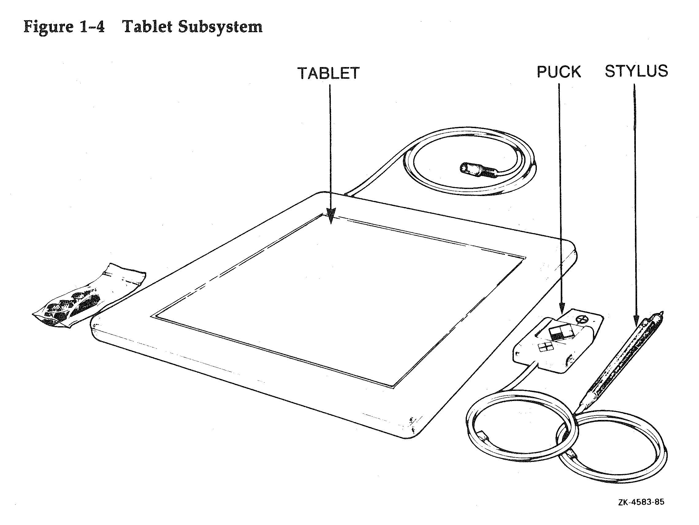
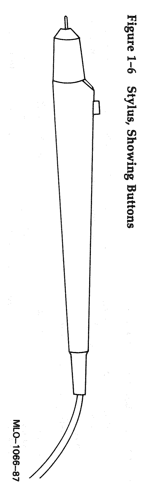
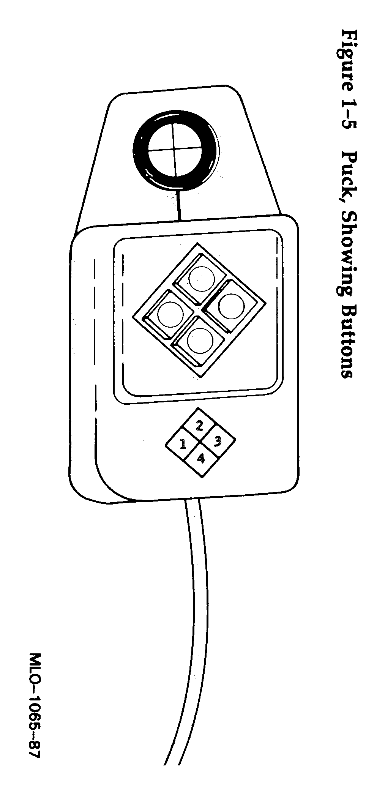

# VT340 Locator Devices

The [Linux kernel][linux] describes the VT340's locator devices like so:

```C
/*
 *      DEC VSXXX-AA mouse (hockey-puck mouse, ball or two rollers)
 *		DEC VSXXX-GA mouse (rectangular mouse, with ball)
 *		DEC VSXXX-AB tablet (digitizer with hair cross or stylus)
 */
```

"Locator devices" is what DEC calls peripheras that indicate point on
the screen. The VT340 could be used with a circular mouse (VSXXX-AA)
or a tablet (VSXXX-AB). The tablet could use either a mouse-like
digitizer (with a reticule and four buttons) or a stylus.






The VT340 sends locator data to the host as keyboard input. The
reports can be wrapped as escape sequences or as plain text
("[314,159]")

[XXX insert screenshot here cross-hair cursor]

When locator input is enabled, the VT340 shows fine crosshairs on the
screen that are moved by the device with no need for application
control. The status bar, which normally shows text cursor row and
column, changes to show the X and Y pixel coordinates.

## Documentation

* [VT340 Programmer's Reference: Chapter 15 Using a Mouse or Tablet][ch15]
* [VT340 Programmer's Reference: Chapter 10 Report Command (in ReGIS)][ch10]
* [VT340 Programmer's Reference: Chapter 13 Tektronix 4014 Emulation][ch13]
* [VCB02 Video Subsystem Technical Manual][VCB02]

[ch15]: https://vt100.net/docs/vt3xx-gp/chapter15.html "Using a Mouse or Tablet"
[ch10]: https://vt100.net/docs/vt3xx-gp/chapter10.html "ReGIS Report Command"
[ch13]: https://vt100.net/docs/vt3xx-gp/chapter13.html "Tektronix 4014 Emulation"
[VCB02]: https://hackerb9.github.io/vt340test/docs/kindred/EK-104AA-TM-001_VCB02_Video_Subsystem_Feb87.pdf "VCB02 Video Subsystem Technical Manual"

## Testing

The VT340 manual describes two ways to read input from a locator
device: ReGIS and GIN. Various terminal emulators from DEC also
implemented a third method, [DEC Locator Mode][decloc], which the
VT340 does _not_ support.

### ReGIS locator test

The primary method for the VT340 is the **ReGIS** method which can be
configured to work in either _1-shot mode_ which request a single
location or _multimode_ which keeps sending mouse data until it is
turned off. The following scripts test those modes.

#### ReGIS One-Shot

<details><summary>One-shot protocol</summary><ul>

The VT340 terminals defaults to one-shot mode when ReGIS is entered.

  |         |     |      |
  |:--------|-----|------|
  | **DCS** | p   | R(P) |
  | 9/11    | 7/0 |      |

  Valid values for the parameter are:

  

</ul></details>

One-shot is quite simple to use as it is synchronous: The host asks
for a location and the terminal lets the user picks a spot on the
screen. The terminal blocks while waiting for the user to press a
button; any data received from the host is buffered to be processed
later.

This method has the advantage of being usable without a mouse. The
arrow keys move the crosshairs and any other key acts as a button
click, sending character and pixel location to the host. 

One-shot mode is documented as being backwards compatible with the
VT240 but not the VT125. It may also work with the VK100 (GIGI).

* [locator1shot.sh][]

#### Multiple Graphics Input Mode

The primary advantages of Multiple Graphics Input Mode ("multimode")
are that the terminal continues to process input data and that the
keyboard can be used to interact with the application normally.

* [locatormulti.sh][]

#### Locator Button Definition: DECLBD

By default, the VT340 only sends events on "mouse down" (button
pressed), but it can be configured to also report "mouse up" (button
released) events. The same method is also be used to configure an
arbitrary response string for each of the four possible locator
buttons. Use the following program to test that functionality.

* [locatorprog.sh][]

Note that different input devices have different numbers of buttons,
but the documentation suggests they all return the same values. It is
unknown as of yet how an application can detect the different devices,
but they do have unique identifiers according to [VCB02][].

|                       | Key 1     | Key 2     | Key 3     | Key 4     |
|-----------------------|-----------|-----------|-----------|-----------|
| Mouse                 | Left      | Middle    | Right     |           |
| Digitizer             | B1        | B2        | B3        | B4        |
| Stylus                | Barrel    | Tip       |           |           |
|-----------------------|-----------|-----------|-----------|-----------|
| Default<br/>down defn | Esc [241~ | Esc [243~ | Esc [245~ | Esc [247~ |
|-----------------------|-----------|-----------|-----------|-----------|
| Default<br/>up defn   | None      | None      | None      | None      |


#### ReGIS Locator Notes

<details><summary>Notes on ReGIS Locator Mode</summary><ul>

* According to a [DEC memo][decloc] from 1989, “REGIS One-shot
  Graphics Input Mode is provided for backward compatibility with the
  VT240.” However, that memo does not mention the VT340's Graphics
  Multiple Input Mode at all.

* The VT340 documentation says that the terminal continues to process
  input normally in Multiple Mode. It turns out this only refers to
  ReGIS mode. Switching back to the standard VT340 escape sequences
  disables the Graphics Input and all mouse events are lost.

* The documentation says the Multiple Mode stays on until it is
  explicitly set back to "one shot mode" or the terminal is reset.
  Actually, exiting and reentering ReGIS mode switches to one shot
  mode.
  
* Exiting ReGIS mode is not a good idea with multimode as rapid
  movements and clicks will be lost, causing the application to feel
  unresponsive.
  
  Note, that implies text output must use ReGIS's text rendering.
  [Tip: For faster rendering, do not clear the rectangle first.
  Use Write Replacement mode (`W(R)`) instead of the default of 
  Write Overlay (`W(V)`).]

* ReGIS's DCS string can be opened in one of four modes, 0 through 3.
  Multimode only seems to work with ReGIS modes 1 and 3. I'm not sure
  why yet. [XXX Investigate]

* Multiple mode always returns reports as escape sequences, never
  plain text.

* Unlike button clicks, moving the mouse is not an event sent by the
  VT340 spontaneously in multimode. The location must be polled by the
  application. This can be done by waiting for a button event with a
  select() timeout of about a tenth of a second, and polling for the
  current position. (See [locatormulti.sh][].)

* vttest has a "dec locator" test, but it only implements the DECTERM
  protocol, not the VT340 mouse.

</ul></details>

### Tektronix GIN mode test

* Enter Tek mode: Send Esc [ ? 3 8 h 

* Enter GIN mode: Send ESC SUB (^Z)

* Receive Report: Format? 

  Chapter 15 says, "See Chapter 13 for the format of the 4010/4014
  mode position report."
  
  Chapter 13 says, "Chapter 15 describes how to use a mouse or tablet
  in GIN mode."

* Exit Tek mode: Send Esc [ ? 3 8 l

#### Tek Notes

* For some reason vttest's Tek mouse test does not work properly with
  the VT340. The GIN crosshairs appear and pressing a key on the
  keyboard shows the keycode and correct location, but mouse clicks
  always send (roughly) the same position repeatedly --- 27 (657, 882).
  [Setting the VT340's Tek GIN terminator from None to CR did not help.]


### DEC Locator test

As mentioned previously, the following sequences do not work on the
VT340. They are merely mentioned as they are quite common in terminal
emulators.

Some of the [DEC Locator][decloc] sequences can be tested using Thomas
Dickey's `vttest` program under the menu: Non-VT100 Tests → XTERM
Special → Mouse → DEC Locator.

[decloc]: https://espterm.github.io/docs/Locator%20Input%20Model%20for%20ANSI%20Terminals%20(sixth%20revision).html

The following summary was borrowed from XTerm's
[ctlseqs](https://www.invisible-island.net/xterm/ctlseqs/ctlseqs.html)
file.

<details><summary>DECRQLP and DECLRP</summary><ul>

* **DECRQLP** Locator Position 

  |         |        |     |      |
  |:--------|:-------|:----|:-----|
  | **CSI** | **Ps** | '   | \|   |
  | 9/11    | 3/?    | 2/7 | 7/12 |

  Valid values for the parameter are:

  Ps = 0, 1 or omitted → transmit a single **DECLRP** locator report

If Locator Reporting has been enabled by a **DECELR**, xterm will respond
with a DECLRP Locator Report. This report is also generated on button
up and down events if they have been enabled with a **DECSLE**, or when
the locator is detected outside of a filter rectangle, if filter
rectangles have been enabled with a **DECEFR**.

* **DECLRP** Locator Report

  |         | event  |      | button |      | row     |      | column  |      | page    |     |     |
  |:-------:|:------:|:----:|:------:|:----:|:-------:|:----:|:-------:|:----:|:-------:|:---:|:---:|
  | **CSI** | **Pe** | ;    | **Pb** | ;    | **Pr**  | ;    | **Pc**  | ;    | **Pp**  | &   | w   |
  | 9/11    | 3/?    | 3/11 | 3/?    | 3/11 | 3/? ... | 3/11 | 3/? ... | 3/11 | 3/? ... | 2/6 | 7/7 |

  Valid values for the event:

  * Pe = 0 → locator unavailable - no other parameters sent
  * Pe = 1 → request - xterm received a DECRQLP
  * Pe = 2 → left button down
  * Pe = 3 → left button up
  * Pe = 4 → middle button down
  * Pe = 5 → middle button up
  * Pe = 6 → right button down
  * Pe = 7 → right button up
  * Pe = 8 → M4 button down
  * Pe = 9 → M4 button up
  * Pe = 1 0 → locator outside filter rectangle

  ‘‘button’’ parameter is a bitmask indicating which buttons are pressed:
  * Pb = 0 → no buttons down
  * Pb & 1 → right button down
  * Pb & 2 → middle button down
  * Pb & 4 → left button down
  * Pb & 8 → M4 button down

  ‘‘row’’ and ‘‘column’’ parameters are the coordinates of the locator
  position in the xterm window, encoded as ASCII decimal. The ‘‘page’’
  parameter is not used by xterm, and will be omitted.

</ul></details>


## Hardware Adapters

### From PS/2 mouse to VT340

Untested, but the idea to use an microcontroller and RS232 level
shifter seems sound:

https://hackaday.io/project/19576-dec-mouse-adapter

### From USB mouse to VT340

[...]

### From USB or PS/2 tablet to VT340

No projects exist yet to recreate the tablet digitizer with its
precision crosshairs or the stylus.

### From DEC mouse to PC serial port

The [Linux kernel][linux] has a builtin driver for the VT340's mouse
peripherals which includes in a comment how to build an adapter so it
can be plugged into a PC's standard RS-232 bus.

[linux]: https://git.kernel.org/pub/scm/linux/kernel/git/torvalds/linux.git/tree/drivers/input/mouse/vsxxxaa.c

<details><summary>Linux kernel's comment from vsxxxaa.c</summary><ul>

```C
/*
 * Building an adaptor to DE9 / DB25 RS232
 * ~~~~~~~~~~~~~~~~~~~~~~~~~~~~~~~~~~~~~~~
 *
 * DISCLAIMER: Use this description AT YOUR OWN RISK! I'll not pay for
 * anything if you break your mouse, your computer or whatever!
 *
 * In theory, this mouse is a simple RS232 device. In practice, it has got
 * a quite uncommon plug and the requirement to additionally get a power
 * supply at +5V and -12V.
 *
 * If you look at the socket/jack (_not_ at the plug), we use this pin
 * numbering:
 *    _______
 *   / 7 6 5 \
 *  | 4 --- 3 |
 *   \  2 1  /
 *    -------
 *
 *	DEC socket	DE9	DB25	Note
 *	1 (GND)		5	7	-
 *	2 (RxD)		2	3	-
 *	3 (TxD)		3	2	-
 *	4 (-12V)	-	-	Somewhere from the PSU. At ATX, it's
 *					the thin blue wire at pin 12 of the
 *					ATX power connector. Only required for
 *					VSXXX-AA/-GA mice.
 *	5 (+5V)		-	-	PSU (red wires of ATX power connector
 *					on pin 4, 6, 19 or 20) or HDD power
 *					connector (also red wire).
 *	6 (+12V)	-	-	HDD power connector, yellow wire. Only
 *					required for VSXXX-AB digitizer.
 *	7 (dev. avail.)	-	-	The mouse shorts this one to pin 1.
 *					This way, the host computer can detect
 *					the mouse. To use it with the adaptor,
 *					simply don't connect this pin.
 *
 * So to get a working adaptor, you need to connect the mouse with three
 * wires to a RS232 port and two or three additional wires for +5V, +12V and
 * -12V to the PSU.
 *
 * Flow specification for the link is 4800, 8o1.
 *
 * The mice and tablet are described in "VCB02 Video Subsystem - Technical
 * Manual", DEC EK-104AA-TM-001. You'll find it at MANX, a search engine
 * specific for DEC documentation. Try
 * http://www.vt100.net/manx/details?pn=EK-104AA-TM-001;id=21;cp=1
 */
```

</ul></details>


