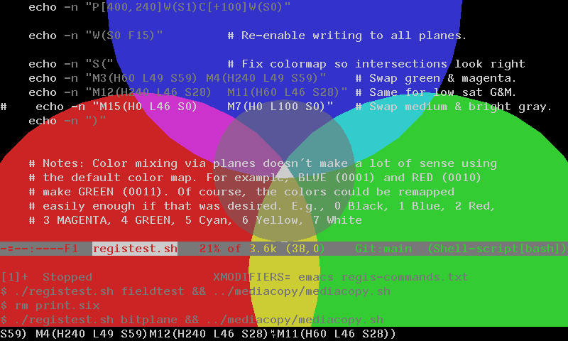

# VT340 Color Planes
The VT340 has four 1-bit color planes. Each pixel makes up a four-bit
number that is looked up in a colormap table to find the actual color.
However, the bit planes can be written to individually, as well, by
using the ReGIS `W(F`_n_`)` "Field" bitmask which is `AND`ed against
any graphical write.

## Example of Using Bitplanes

The bitplane() function in the [registest.sh](registest.sh) file
exercises the ReGIS's W(F_n_) bitmask.

<details><summary>Click here to see the bitplane() function</summary>

```bash
bitplane() {
    # Test of writing to each of the four bitmap planes of the VT340.
    echo "W(I15)"		# Color "15", normally would turn all 4 bits on
    echo "W(F1)"		# F1 bitmask: Only plane 0
    echo "P[400,0]W(S1)C[+250]W(S0)"
    echo "W(F2)"		# F2 bitmask: Only plane 1
    echo "P[200,380]W(S1)C[+250]W(S0)"
    echo "W(F4)"		# F4 bitmask: Only plane 2
    echo "P[600,380]W(S1)C[+250]W(S0)"
    echo "W(F8)"		# F8 bitmask: Only plane 3
    echo "P[400,240]W(S1)C[+100]W(S0)"
    echo "P[400,240]W(S1N1)C[+50]W(S0N0)" # Negate inner circle

    echo "W(F15)"		# Re-enable writing to all planes.
    echo "S("		# Adjust colormap so intersections look right
    echo "M4(H240 L49 S59)	M3(H60 L49 S59)" # Swap green & magenta.
    echo "M12(H240 L46 S28)	M11(H60 L46 S28)" # Same for low sat G&M.
    echo "M15(H0 L46 S0)	M7(H0 L100 S0)"	  # Swap medium & bright gray.
    echo ")"

    echo -n ${ST}
    tput cup 1000
    read -s -n1 -p "Magenta & green swapped. Hit any key to reset colormap to default..."
    echo -n $'\r'
    tput el
    echo -n ${DCS}p

    echo "S("		# Undo changes to colormap
    echo "M3(H240 L49 S59)	M4(H60 L49 S59)"
    echo "M11(H240 L46 S28)	M12(H60 L46 S28)"
    echo "M7(H0 L46 S0)		M15(H0 L100 S0)"
    echo ")"
}
```
</details>

Here is what the output from a VT340 looks like, at the point when the
script swaps magenta and green:




## Default VT340 colors, seen as bit planes

| Index | F8 | F4 | F2 | F1 | Color name        |   H |  L |  S |
|-------|----|----|----|----|-------------------|----:|---:|---:|
| 0     | 0  | 0  | 0  | 0  | Black             |   0 |  0 |  0 |
| 1     | 0  | 0  | 0  | 1  | Blue              |   0 | 49 | 59 |
| 2     | 0  | 0  | 1  | 0  | Red               | 120 | 46 | 71 |
| 3     | 0  | 0  | 1  | 1  | Green             | 240 | 49 | 59 |
| 4     | 0  | 1  | 0  | 0  | Magenta           |  60 | 49 | 59 |
| 5     | 0  | 1  | 0  | 1  | Cyan              | 300 | 49 | 59 |
| 6     | 0  | 1  | 1  | 0  | Yellow            | 180 | 49 | 59 |
| 7     | 0  | 1  | 1  | 1  | Medium Gray (50%) |   0 | 46 |  0 |
| 8     | 1  | 0  | 0  | 0  | Dark Gray (25%)   |   0 | 26 |  0 |
| 9     | 1  | 0  | 0  | 1  | Desat Blue        |   0 | 46 | 28 |
| 10    | 1  | 0  | 1  | 0  | Desat Red         | 120 | 42 | 38 |
| 11    | 1  | 0  | 1  | 1  | Desat Green       | 240 | 46 | 28 |
| 12    | 1  | 1  | 0  | 0  | Desat Magenta     |  60 | 46 | 28 |
| 13    | 1  | 1  | 0  | 1  | Desat Cyan        | 300 | 46 | 28 |
| 14    | 1  | 1  | 1  | 0  | Desat Yellow      | 180 | 46 | 28 |
| 15    | 1  | 1  | 1  | 1  | White (Gray 75%)  |   0 | 79 |  0 |

## Color mixing peculiarities

<details><summary>Click here for discussion of color mixing</summary>

The apparent intersections where colors should mix via bitplanes does
not make a lot of sense using the default color map on the VT340. In
particular, BLUE (0001) and RED (0010) make GREEN (0011)! Of course,
the colors could be remapped easily enough. It turns out only three
pairs need to be swapped to be make intersections look correct.

1. Swap magenta and green (3 and 4)
1. Swap low saturation magenta and green (11 and 12)
1. Swap medium gray with light gray (7 and 15)

<details<summary>Click for a swapped color table</summary>

| Index | F8 | F4 | F2 | F1 | Color name        |   H |  L |  S |
|-------|----|----|----|----|-------------------|----:|---:|---:|
| 0     | 0  | 0  | 0  | 0  | Black             |   0 |  0 |  0 |
| 1     | 0  | 0  | 0  | 1  | Blue              |   0 | 49 | 59 |
| 2     | 0  | 0  | 1  | 0  | Red               | 120 | 46 | 71 |
| 3     | 0  | 0  | 1  | 1  | Magenta           |  60 | 49 | 59 |
| 4     | 0  | 1  | 0  | 0  | Green             | 240 | 49 | 59 |
| 5     | 0  | 1  | 0  | 1  | Cyan              | 300 | 49 | 59 |
| 6     | 0  | 1  | 1  | 0  | Yellow            | 180 | 49 | 59 |
| 7     | 0  | 1  | 1  | 1  | White (Gray 75%)  |   0 | 79 |  0 |
| 8     | 1  | 0  | 0  | 0  | Dark Gray (25%)   |   0 | 26 |  0 |
| 9     | 1  | 0  | 0  | 1  | Desat Blue        |   0 | 46 | 28 |
| 10    | 1  | 0  | 1  | 0  | Desat Red         | 120 | 42 | 38 |
| 11    | 1  | 0  | 1  | 1  | Desat Magenta     |  60 | 46 | 28 |
| 12    | 1  | 1  | 0  | 0  | Desat Green       | 240 | 46 | 28 |
| 13    | 1  | 1  | 0  | 1  | Desat Cyan        | 300 | 46 | 28 |
| 14    | 1  | 1  | 1  | 0  | Desat Yellow      | 180 | 46 | 28 |
| 15    | 1  | 1  | 1  | 1  | Medium Gray (50%) |   0 | 46 |  0 |
</details>


</details>


### Colormap affects text rendering

As mentioned in the [colormap notes](../colormap/colormap.md), some of
the locations in the color map affect the screen text. Briefly: 0 Screen
Background, 7 Foreground Text, 8 Bold+Blink FG, 15 Bold Foreground. 

If you need to reset the colormap to the VT340 defaults, you can `cat`
the file [resetpalette.regis](resetpalette.regis).

<details><summary>Click to see data</summary>

```
Esc P0p
S(
M 0 	(H  0 L  0 S  0)
M 1 	(H  0 L 49 S 59)
M 2 	(H120 L 46 S 71)
M 3 	(H240 L 49 S 59)
M 4 	(H 60 L 49 S 59)
M 5 	(H300 L 49 S 59)
M 6 	(H180 L 49 S 59)
M 7 	(H  0 L 46 S  0)
M 8 	(H  0 L 26 S  0)
M 9 	(H  0 L 46 S 28)
M 10	(H120 L 42 S 38)
M 11	(H240 L 46 S 28)
M 12	(H 60 L 46 S 28)
M 13	(H300 L 46 S 28)
M 14	(H180 L 46 S 28)
M 15	(H  0 L 79 S  0)
)
Esc \
```
</details>

