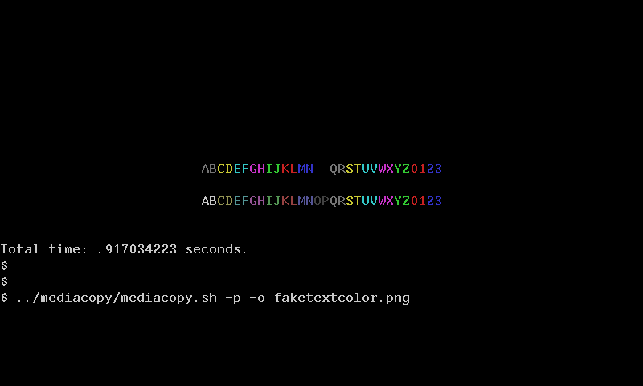

# Coloring text pixels using ReGIS

It is not possible to have multicolored text on the VT340 because the
value of any pixel of text is 0111₂, which is an index into the
colormap. No matter what color the colormap entry is changed to, all
text will change simultaneously since it all points to the same place.

But, it is possible to color pixels already on the screen, including
text, by selectively erasing the bitplane using the ReGIS `W(F())`
operator. 


## How to do it

Example code:

```bash
DCS=$'\eP'
ST=$'\e\\'
echo "${DCS}1p; S(E) W(M20,I0) ${ST}"
tput cup 10 25
tput bold			# Bold text pixels are set to 1111
echo -n "ABCDEFGHIJKLMNOPQRSTUVWXYZ012345"


echo "${DCS}0p;"
echo "P[250,200]"

# Enable only certain fields (bitplanes) for writing.
for ((i=0; i<16; i++)); do
    echo "F(V(W(F${i})) 0642) v0 "
done

echo "${ST}"
```



## References

* https://vt100.net/docs/vt3xx-gp/chapter3.html

* [faketextcolor.sh](faketextcolor.sh)

## How fast is it? 

The above implementation is rather slow, taking about nearly half a
second on a VT340+ to colorize 32 characters. There is likely some
faster way as no optimization has been attempted, yet.

## What if the screen scrolls?

Colorized text scrolls properly with the screen.

## What if the text is shifted via inserts?

Not tested.

