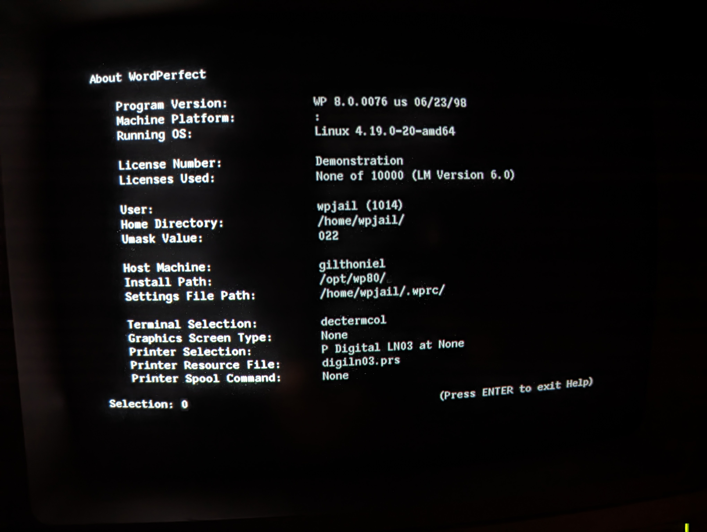
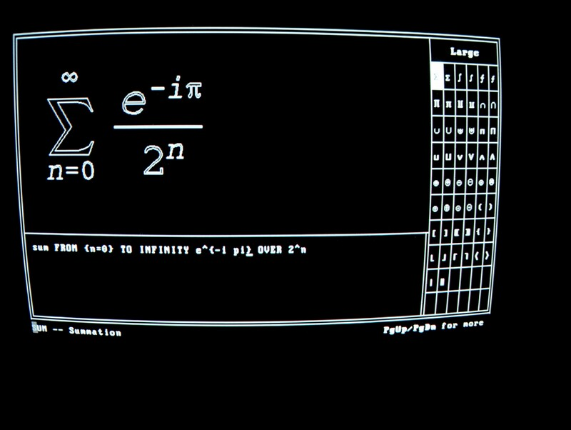
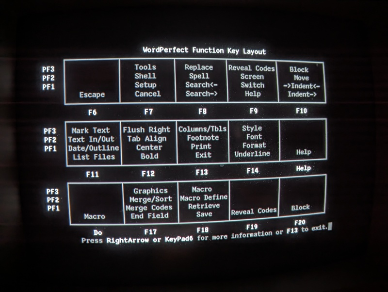
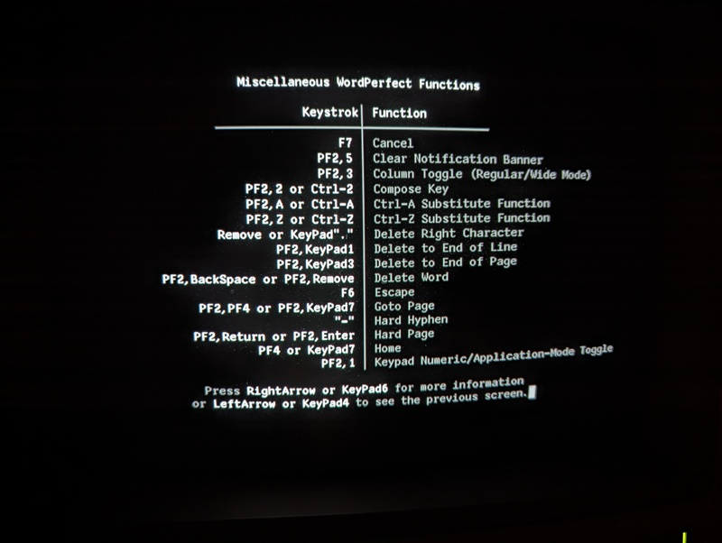

# WordPerfect for UNIX Character Terminals

Thanks to the work of Tavis Ormandy
([taviso](https://github.com/taviso)), one can now easily run the
32-bit binaries of a word processor from the turn of the century which
outputs sixel graphics specifically for the VT340. See Tavis's
[wpunix](https://github.com/taviso/wpunix) project which includes
easily installable packages for Debian and other popular GNU/Linux
flavors.

<ul><i>

For raw data and notes on the sixel format used by WordPerfect, please
see [sixeloutput](sixeloutput/README.md).

</i></ul>

 

## Getting it to work on a VT340

	wp -t vt220 -G vt340hi_sixel

For some reason wp (WordPerfect) does not pay attention to the TERM
settings and always states that its termtype is "xterm". This results
in garbled screens, for example this equation editor which has an odd
purple double image. The solution is to run wp with the argument `-t
vt220` [sic] and set the graphics type to `vt340hi_sixel`. As you can
see, that gives much better results:

 

### vt340.trs

I have created a terminal definition for the VT340 using `wpterm` to
modify the vt220 definition. The major improvements are using [a 10x20
soft font](cit10x20.bin) for the line drawing characters and
defaulting to vt340hi_sixel for graphics. To use it, copy
[vt340.trs](vt340.trs) into /opt/wp80/shlib10/ and export
WPTERM=vt340.

The line drawings provide the boxes for the menus and the "mosaic"
font used for very low-resolution print preview. It makes WordPerfect
look snazzier than it did with the ill-fitting VT220 font. However,
this font may not be the best idea. The VT340 can have only one soft
font and the menus could have simply used the builtin line drawings
characters instead. Is it possible to convince WordPerfect to use DEC
Graphics for boxes?

If we can have our own softfont, how do we use it in wordperfect? We'd
like it to show other characters in text, such as mathematical
symbols. `wpterm` must have some solution.

Note: WordPerfect already shows many mathematical symbols in the
equation editor (hit the <kbd>LIST</kbd> (F11) key and use
<kbd>PgDn</kbd> (Keypad 3). It may be possible to reuse those as a
font by using the `wpterm` program.

## Keys

WordPerfect uses all the functions keys and the application keypad. 

It also uses <kbd>PF1</kbd> (the "GOLD KEY"), <kbd>PF2</kbd>, and
<kbd>PF3</kbd> as "dead keys" which do a single shift to select
alternate functions. One nice thing about WordPerfect is that one can
hit the VT340's <kbd>Help</kbd> key at any time for context sensitive
help. Hit it a second time to get a list of the keyboard layout. Here
are some photos of the help screens. [_Sorry, I don't have this in
text format yet. --b9_]

[XXX: Replace images with correct screenshots].

[XXX: Add text version]. 

<ul>

_Caveat:_ These keyboard shortcut photos are from when I mistakenly
thought the correct terminal type was "dectermcol", which is probably
identical to the "vt220" keyboard map. 

WordPerfect's DECTerm Color terminal type cannot be used with the
VT340 because it does not include sixel graphics, although it does
seem to have better character support which perhaps should be
investigated. It may be possible to modify it to allow sixel graphics
and create a better driver for the VT340.

</uL>

### **IMPORTANT**: Do not hit the F5 key. 

<kbd>F5</kbd> causes WordPerfect to immediately die.

On the VT340, <kbd>F5</kbd> sends an RS232 'break' which the Linux
kernel interprets as a request to send an interrupt signal to the
current process. You can disable that effect by using `stty -brkint`.
However, I've found it useful, actually. There were times when I had
remapped keys to a point where I couldn't exit wordperfect. It is also
handy for quitting the `wpkey` utility.

### Even more keys, documentation not yet found

Although not listed in the online help, certain control keys work,
such as <kbd>Ctrl</kbd><kbd>P</kbd> to print. [XXX: Surely there is a
list somewhere? Wpterm just shows it as "P Substitution"]

The VT340's builtin <kbd>Compose</kbd> key works as usual to insert
characters like æ, ü, é and to type hexadecimal using the number pad.

### Menu key weirdness

<kbd>PF3</kbd><kbd>=</kbd> opens the **File** menu without requiring a
mouse. It is extremely awkward so it seems unlikely this was truly the
way people used WordPerfect. Was it mouse driven?

<kbd>Esc</kbd><kbd>F</kbd> also (sometimes) works for "xterm" to open
the File menu, but does not ever work for "vt220", instead complaining
about some missing file. I may be able to rebind it to something more
useful, like the <kbd>Main Screen</kbd> key.

## LK201 Gold Key Editing Keyboard for document processing

 

The biggest problem with WordPerfect is the difficulty remembering all
the different key strokes. Yes, one can hit Help twice to see a list,
but it is still cumbersome because of the weird use of multiple shifts
(<kbd>PF1</kbd>, <kbd>PF2</kbd>, and <kbd>PF3</kbd>) giving most
function keys four different meanings. If you have a keyboard which
has wordprocessing commands written in gold on the front of the
letters and in other colors on top of the keypad, you'll find that
WordPerfect does not correspond at all. It should be possible,
however, to ditch the DOS compatibility and create a more sane
keyboard mapping. [XXX: has someone already done this?]

## To do

* Add the sixel output from wordperfect for the equation editor for
  the terminal types that support it (vt220, xterm, kermit, perhaps
  more).

* WordPerfect may use the VT340's "locator" (mouse) for its menus, so
  I should find one and see if it works.
  
* Does WordPerfect support the built-in TCS font for large symbols,
  like summation? It doesn't seem to do it by default. Did it use to,
  for example in WordPerfect 5.2?
  
* The VT340 isn't affected, but the xterm driver has many segmentation
  faults when editing in the equation editor? (Particularly when
  hitting the Help key). Was this the way it was back in the day?

