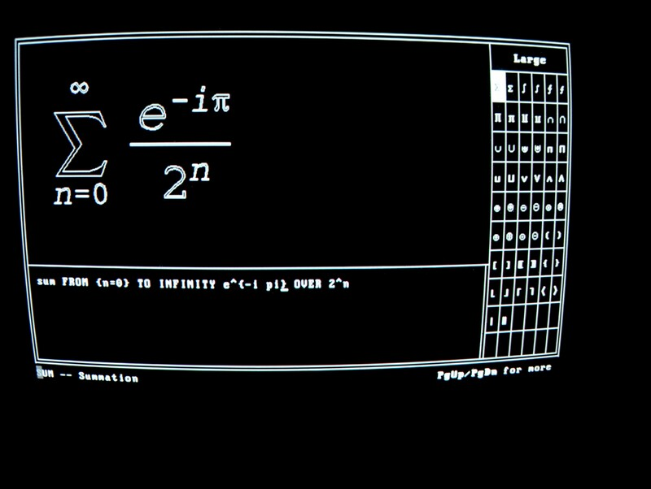

# WordPerfect for UNIX Character Terminals

Thanks to the work of Tavis Ormandy
([taviso](https://github.com/taviso)), one can now easily run the
32-bit binaries of a word processor from the turn of the century which
outputs sixel graphics specifically for the VT340. See Tavis's
[wpunix](https://github.com/taviso/wpunix) project which includes
easily installable packages for Debian and other popular GNU/Linux
flavors.

 

<ul>

For typescripts and notes on the sixel data used by WordPerfect,
please see [sixeloutput](sixeloutput/README.md).

</ul>

## Getting it to work on a VT340

	wp -t vt220 -g vt340hi_sixel

For some reason wp (WordPerfect) does not pay attention to the TERM
settings and always states that its termtype is "xterm". This results
in garbled screens, for example this equation editor which has an odd
purple double image. The solution is to run wp with the argument `-t
vt220` [sic] and set the graphics type to `vt340hi_sixel`. As you can
see, that gives much better results:

 

## Keys

WordPerfect uses all the functions keys and the application keypad. 

It also uses <kbd>PF1</kbd> (the "GOLD KEY"), <kbd>PF2</kbd>, and
<kbd>PF3</kbd> as "dead keys" which do a single shift to select
alternate functions. One nice things about WordPerfect is that one can
hit the VT340's <kbd>Help</kbd> key at any time for context sensitive
help. Hit it a second time to get a list of the keyboard layout. Here
are some photos of the help screens. [_Sorry, I don't have this in
text format yet. --b9_]

[XXX: Replace images with correct screenshots].

[XXX: Add text version]. 

<ul>

_Caveat:_ These keyboard shortcut photos are from when I mistakenly
thought the correct terminal type was "dectermcol", which is probably
identical to the "vt220" keyboard map. 

WordPerfect's DECTerm Color terminal type cannot be used with the
VT340 because it does not include sixel graphics, although it does
seem to have better character support which perhaps should be
investigated. It may be possible to modify it to allow sixel graphics
and create a better driver for the VT340.

</uL>

### **IMPORTANT**: Do not hit the F5 key. 

<kbd>F5</kbd> causes WordPerfect to immediately die on my terminal. I
believe it sends a 'break', which should be ignored. It may be
misbehaving because of the way I am running it in a specially created
account, using 'su'.

### Even more keys, documentation not yet found

Although not listed in the online help, certain control keys work,
such as <kbd>Ctrl</kbd><kbd>P</kbd> to print. [XXX: Surely there is a
list somewhere?]

The VT340's builtin <kbd>Compose</kbd> key works as usual to insert
characters like æ, ü, é.

### Menu key mystery

When the terminal type is set to xterm, <kbd>Esc</kbd><kbd>=</kbd>
opens the **File** menu without requiring a mouse. That menu key
sequence is supposed to be listed in the upper right hand corner of
the screen, but when the terminal is set to "vt220", it just shows
empty parentheses `()`.

<kbd>Esc</kbd><kbd>F</kbd> also (sometimes) works for "xterm" to open
the File menu, but does not ever work for "vt220", instead complaining
about some missing file.

## LK201 Gold Key Editing Keyboard for document processing

[XXX: Add photo here]

The biggest problem with WordPerfect is the difficulty remembering all
the different key strokes. Yes, one can hit Help twice to see a list,
but it is still cumbersome because of the weird use of multiple shifts
(<kbd>PF1</kbd>, <kbd>PF2</kbd>, and <kbd>PF3</kbd>) giving most
function keys four different meanings. If you have a keyboard which
has wordprocessing commands written in gold on the front of the
letters and in other colors on top of the keypad, you'll find that
WordPerfect does not correspond at all. It should be possible,
however, to create a keyboard mapping. [XXX: has someone already done
this?]

## To do

* Add the sixel output from wordperfect for both the equation editor
  and the print preview for the terminal types that support it (vt220,
  xterm, kermit, perhaps more).

* WordPerfect may use the VT340's "locator" (mouse) for its menus, so
  I should find one and see if it works.
  
* Does WordPerfect support the built-in TCS font for large symbols,
  like summation? It doesn't seem to do it by default. Did it use to,
  for example in WordPerfect 5.2?
  
* Can one convince WordPerfect to use a VT340 soft-font with
  additional characters? It already shows mathematical symbols as
  sixels in the equation editor (hit the <kbd>LIST</kbd> (F11) key and
  use <kbd>PgDn</kbd> (Keypad 3)). There is no reason they shouldn't
  be usable in text editing mode, too. (Or, at least 96 of the user's
  favorite ones).
  
* The VT340 isn't affected, but the xterm driver has many segmentation
  faults when editing in the equation editor? (Particularly when
  hitting the Help key). Was this the way it was back in the day?

