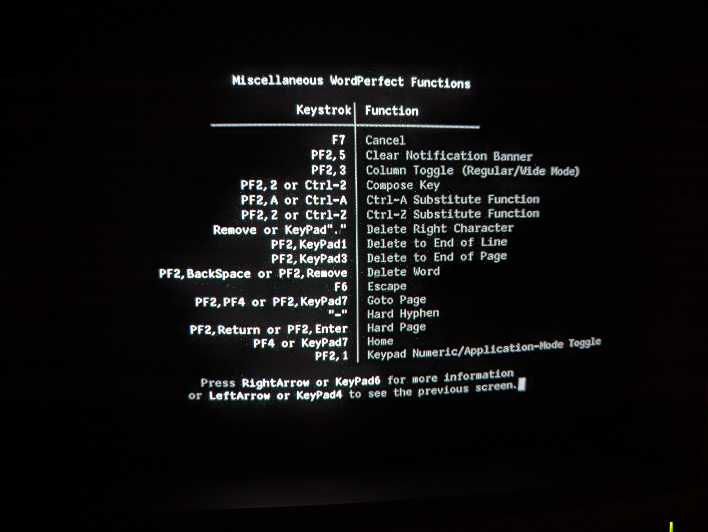

# WordPerfect for UNIX Character Terminals

Thanks to the work of Tavis Ormandy
([taviso](https://github.com/taviso)), one can now easily run the
32-bit binaries of a word processor from the turn of the century which
outputs sixel graphics specifically for the VT340. See Tavis's
[wpunix](https://github.com/taviso/wpunix) project which includes
easily installable packages for Debian and other popular GNU/Linux
flavors.

 

## Getting it to work on a VT340

	wp -t vt220 -g vt340_sixelhi

For some reason wp (WordPerfect) does not pay attention to the TERM
settings and always states that its termtype is "xterm". This results
in garbled screens, for example this equation editor which has an odd
purple double image:

The solution is to run wp with the argument `-t vt220` [sic] and set
the graphics type to "vt340_sixelhi". That gives much better results.

## Keys

WordPerfect uses all the functions keys and the application keypad
usually, though not always, in the way the wordprocessing keyboard is
labelled (in green on the side).

It also uses PF1 (the "GOLD KEY"), PF2, and PF3 as "dead keys" which
do a single shift to select alternate functions. One nice things about
WordPerfect is that one can hit the Help key cat any time for context
sensitive help. Hit it a second time to get a list of the keyboard
layout. Here are some photos of the help screens. [_Sorry, I don't have this in text format yet. --b9_]

_Caveat:_ These keyboard shortcut photos are from when I mistakenly
thought the correct terminal type was "dectermcol", which is close to
the "vt220" keyboard map, but I am not yet 100% positive it is
identical. 

WordPerfect's DECTerm Color terminal type cannot be used with the
VT340 because it does not include sixel graphics, although it does
seem to have better character support which perhaps should be
investigated. It may be possible to modify it to allow sixel graphics
and create a better driver for the VT340. 
