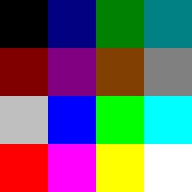

# Typescripts from running WordPerfect

These log files attempt to answer what output WordPerfect created for
the VT340 and other sixel terminal devices. (What escape codes are
sent before and after a print? How many DCS strings are used to
display an image? How are colors set? Did the output differ between
the terminals?)

## Files

Sixel output from print preview for different terminal type settings:

* [vt220 print](sixeloutput/vt220.print)
* [xterm print](sixeloutput/xterm.print)
* [kermit print](sixeloutput/kermit.print)

Entire session including escape sequences at startup and shutdown

* [vt220 typescript](sixeloutput/vt220.typescript)
* [xterm typescript](sixeloutput/xterm.typescript)
* [kermit typescript](sixeloutput/kermit.typescript)

## WordPerfect's sixel output

### Structure common to all sixel terminals

* Each image is made up of about twenty DCS strings.
* The first DCS string is the colormap, which is sent separately from
  any image data.
* The colormap defines colors in the order 1, 2, …, 14, 15, 0. Color
  `#0` is always black.
* An escape sequence to move the cursor to the home position (`Esc`
  `[` `H`) is sent before each DCS string that contains image data.
* The image data strings do _not_ define the colors they use.
* Each DCS string starts with a varying number of `----` (Graphic New
  Lines) to skip to the place the previous string left off.
* All image data strings end with a `-` (single Graphic New Line)
  except the very last. This makes sense for sixel data that was
  designed to be contained in one DCS string. It is unclear what the
  purpose is here given that the cursor is always moved to the home
  position.

These peculiarities were likely due to device limitations of the day.

The VT240 required each sixel image to start at the top of the screen.
By sending the cursor to the home position, WordPerfect simulates the
same restriction and results in less duplication of code.

The specific ordering of the colors in the colormap was necessary on
the VT340 for the sixel color numbers to exactly match the terminal's
colormap indices. The sixteenth color set is color `#0` which is
important because that's the one that changes the VT340's background.

Question: Why was the image broken into multiple strings? Was there
some terminal which could only handle short DCS strings? [XXX: Try
running Kermit on an IBM PC.]

### Xterm Quirks

* Each sixel DCS string starts with `?$` — blank sixel followed by
  Graphic Carriage Return — which would seem to do nothing. Why?

* A colormap is sent twice. 

  * Before the image data the colormap looks like typical DOS EGA.
	Each RGB channel can be either off, half, or full intensity.

	
	
	

	␛P;1;;q?$#1;2;0;0;50#2;2;0;50;0#3;2;0;50;50#4;2;50;0;0#5;2;50;0;50#6;2;50;25;0#7;2;50;50;50#8;2;75;75;75#9;2;0;0;100#10;2;0;100;0#11;2;0;100;100#12;2;100;0;0#13;2;100;0;100#14;2;100;100;0#15;2;100;100;100#0;2;0;0;0␛\

	

	 

  * The second, after all the image data, looks like a typical
    terminal colormap, using in-between shades for RGB. It is probably
    an attempt to reset xterm to its default colors.
	
	

	

	␛P;1;;q?$#1;2;20;20;80#2;2;80;13;13#3;2;20;80;20#4;2;80;20;80#5;2;20;80;80#6;2;80;80;20#7;2;53;53;53#8;2;26;26;26#9;2;33;33;60#10;2;60;26;26#11;2;33;60;33#12;2;60;33;60#13;2;33;60;60#14;2;60;60;33#15;2;80;80;80#0;2;;;?$␛\

	

	 

  * Note that a second colormap would not work with a VT340 as it
    would change the colors of the graphics already drawn.

### Kermit Quirks

* WordPerfect sends the sequence to put the terminal into Tektronix
  graphics mode (`Esc [ ? 34 h`), which is weird as, on a genuine
  VT340, one cannot see sixels when the terminal is showing Tek
  graphics. Perhaps this is because Kermit displayed sixels on an
  alternate screen, similar to how the VT340 shows Tek graphics. 
  [XXX: Was this strangeness a genuine requirement of Kermit?]

## General information about the different terminals

## wp -t kermit 

MSKermit, a telecommunications program and terminal emulator from
Columbia University, included "VT340 sixel support" starting with
version 3.0. 

### Kermit Files

* [kermit.typescript](kermit.typescript): Full typescript of running
  `wp -t kermit` and doing a print preview. Includes escape codes
  before and after the program.

* [kermit.print](kermit.print): Excerpt which contains just the sixel
  image from the print preview. The image is made up of multiple DCS
  strings. The image colormap is set in the first DCS string, which
  would work on the VT340, but not most terminal emulators. 
  
* [kermit.print.cleaned](kermit.print.cleaned): Modified excerpt which
  merges the image into a single DCS string which can be viewed on
  most terminal emulators.
  
  
