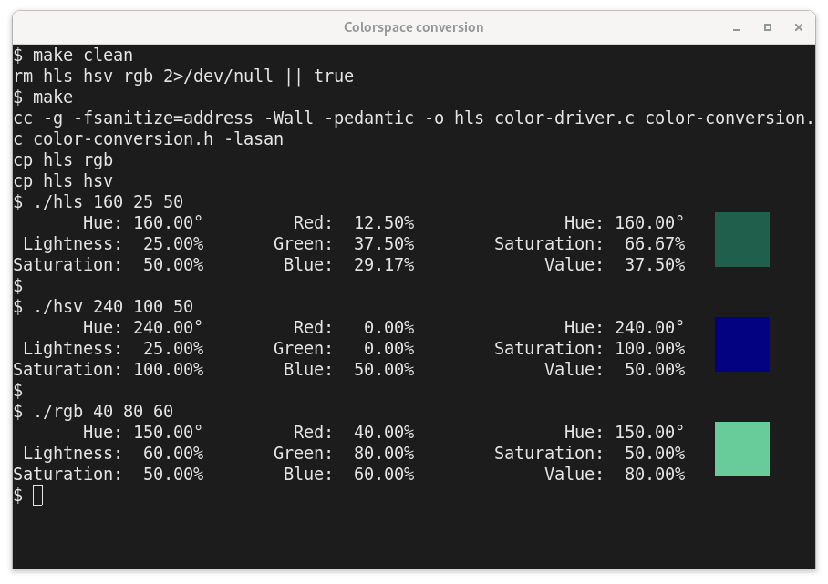

# Colorspace Conversions

Three command line programs (hls, rgb, hsv) to convert between
colorspaces using the sample code from one of 
[DEC's programming manuals](http://www.bitsavers.org/pdf/dec/vax/vms/vms_workstation/AA-MI67A-TE_A_Guide_to_Migrating_VWS_Applications_to_DECwindows_Sep1989.pdf).
Given a color in one of the colorspaces, the values are shown for all
three colorspaces.
    
Just for fun, a color swatch is displayed if the terminal has sixel support.

## Example

	$ ./rgb 40 80 60
		   Hue: 150.00°         Red:  40.00%               Hue: 150.00°
	 Lightness:  60.00%       Green:  80.00%        Saturation:  50.00%
	Saturation:  50.00%        Blue:  60.00%             Value:  80.00%

## Compilation

Just run `make`. 

Or, use `cc -o hls color-conversion.c color-driver.c` to compile. Then
copy (or link) `hls` to `rgb` and `hsv`.

## HLS Usage

  **hls** _Hue_ _Lightness_ _Saturation_

| Parameter    | Range     | Description                            |
|--------------|-----------|----------------------------------------|
| _Hue_        | 0 to 360° | red is 0°, green is 120°, blue is 240° |
| _Lightness_  | 0 to 100% | black 0%, pure color 50%, white 100%   |
| _Saturation_ | 0 to 100% | grayscale is 0%, color is 100%         |

Note: "Saturation" in HLS has a slightly different meaning than in HSV.

## RGB Usage

  **rgb** _Red_ _Green_ _Blue_   (range from 0.0 to 100%)

## HSV Usage:

 **hsv** _Hue_ _Saturation_ _Value_

| Parameter    | Range     | Description                            |
|--------------|-----------|----------------------------------------|
| _Hue_        | 0 to 360° | red is 0°, green is 120°, blue is 240° |
| _Saturation_ | 0 to 100% | grayscale is 0%, color is 100%         |
| _Value_      | 0 to 100% | black is 0%, full brightness is 100%   |

Note: "Saturation" in HSV has a slightly different meaning than in HLS.

## Discussion

This sample colorspace conversion code in
[color-conversion.c](color-conversion.c) came from 
[_Migrating VWS Applications to DECwindows_](http://www.bitsavers.org/pdf/dec/vax/vms/vms_workstation/AA-MI67A-TE_A_Guide_to_Migrating_VWS_Applications_to_DECwindows_Sep1989.pdf), 
Sep 1989, Appendix F.
    
The code, as printed, had some surprising bugs. It must have undergone
some transformation or transcription before being printed in the
DECwindows documentation. Those bugs are fixed in this copy. 

### What color is zero degrees?

One of the comments in the code says,

> \*\*NOTE\*\* This routine follows the UIS [DEC's User Interface
> Services] convention of RED at 0° instead of the industry standard
> convention of locating BLUE at 0°. To convert to industry standard,
> the input Hue should have 120° subtracted from it.

That's a slightly weird statement because 35 years later the opposite
is true. The industry standard convention is to have RED at 0°. It is
DEC's VT340 which is the oddball by having BLUE at 0°.

But, this is useful information for us. To convert from the VT340's
HLS to RGB, one must subtract 120 from the hue. And, when converting
from RGB to HLS, one must add 120. 

The program `blue0hls` does this for you automatically. 

